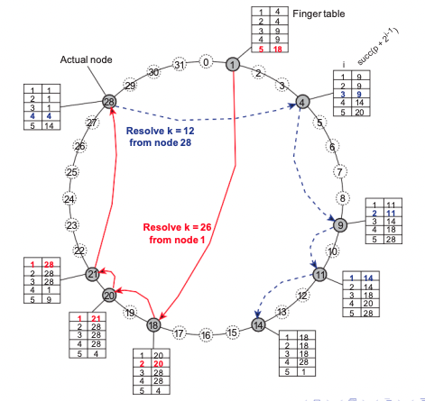

## Exercicios Capitulo 1

1. **Uma definicao alternativa para um SD é que ele é um conjunto de computadores independentes que da a impressao de ser um sistema unico, isto é, o fato de haver varios computadores fica completamente oculto para os usuarios. De um exemplo para o qual essa visao viria muito a calhar.**
Hoje em dia sao muitos dos exemplos que podemos citar que vao de encontro a essa definicao. Um deles seria o Google docs, por exemplo um usuario poderia acessar essa aplicacao de maneira transparente, mas por tras sao varias maquinas distribuidas que atuam ccomo um  ssitema unico e coerente. Outros exemplos bem populares hoje com o uso da nuvem, sao cloudfront que tem varios servidores espalhados geograficamente, mas que funcionam como um unico servico de distribuicao de conteudo.

2. **Qual é o Papel do middleware em um sistema distribuidos?**
Em um SD o middleware pode atuar de diversas maneira, como por exemplo com a funcao de seguranca, replicacao, uma camada que te prove servicos para aplicacoes independente do que essas fazem. Podendo ser servicos de seguranca, replicacao, essenciais para confiabilidade do sistema distribuido. É um tipo de software que atua como um intermediário entre diferentes aplicativos ou sistemas. Sua principal função é `facilitar a comunicação e a interação entre esses sistemas`, permitindo que eles se conectem e troquem informações de maneira eficiente.
*Camada de middleware*
Acima da camada de transporte
- Prover servicoes e protocolos frequentemente usados que podem ser utilizados por varias aplicacoes diferentes
- Um conjunto rico de protocolos de comunicacao
- Desempacotamento de dados, necessarios para a integracao de sistemas
- protocolos de gerenciamento de nomes, para auxiliar o compartilhamento de recursos
- Protocolos de seguranca para comunicacoes seguras
- mecanismos de escalabilidade como replicacao e caching
  
4. **Explique o que quer dizer transparencia(de distribuicao) e de exemplos de diferentes tipos de transparencia.**
Transparencia de distribuicao: capacidade de ocultar a complexidade da distribuicao dos recursos e servicos, permitindo que os usuarios e aplicativos interajam com o sistema como se fosse unico e centralizado. Exemplos de diferentes tipos de transparencia de distribuicao(7 tipos): 
   1. acesso: cliente nao deve saber tambem COMO e ONDE esta sendo chamado os outros nodes, pois precisa ser um sistema unico
   2. localizacao: Esconder onde o objeto esta localizado(exemplo URL, vc nao sabe onde esta a pagina web); 
   3. relocalizacao: de forma transparente o acesso ao cliente muda para o servidor novo com o mesmo processo trazendo mais velocidade de desempenho.(Esconde que um objeto pode ser movido para outra localidade enquanto esta sendo utilizado). Quem define é o SD /= de migracao;
   4. migracao: A diferenca entre Relocalizacao, é que aqui o cliente que define que o objeto deve ser migrado para outro local; 
   5. replicacao: a replicacao ocorre mas o cliente nem sabe que ocorre; 
   6. concorrencia: Esconder que um objeto pode ser `compartilhado` entre diferentes usuarios independentes.; 
   7. falhas: Esconder falhas e a possivel recuperacao de um objeto;

5. **Por que as vezes é tao dificil ocultar a ocorrencia e a recuperacao de falhas em um sistema distribuido?**       
[?]

6. **Por que nem sempre é uma boa visar a implementacao do mais alto grau de transparencia possivel?**        
Nem sempre é uma boa visar a implementacao do mais alto grau de transparencia possivel, pois tras `complexidade` a arquitetura do sistema, que dificulta a manutencao dos sistema. Alem disso pode ter um custo no `desempenho` por ter muita complexidade na compunicacao, pode tornar o sistema mais lento. Com muitos processos rodando e complexidade pode acontecer de ter `sobrecarga na rede` pelo aumento na quatidade de trafego, aumentando a latencia nas comunicacoes. E tambem pode afetar a escalabilidade negativamente, por limita-la conforme cresce a demanda do sistema.

7. **O que é um sistema distribuido aberto e quais sao os beneficios que a abertura proporciona?**        
Um sistema distribuido aberto é um sistema que independe de linguagem de programacao, plataforma, e hardware, pois por meio de interfaces(cabecalho, nao implementacao) bem definidas sao capazes de interagir com outros sistemas abertos. Beneficios é essa interoperabilidade por conta das interfaces, independencia. alem disso ha uma maior flexibilidade de tecnologia. 

8. **Descreva com Exatidao o que quer dizer um sistema escalavel.**       
Um sistema escalavel é um sistema que mantem o desempenho mesmo com um aumento grande de requisicoes no sistema, independente do numero de usuarios/processos, distancia entre nodes, e numeros de dominios administrativos. 3 tipos de escalabilidade: `tamanho`, `geografica`, `administrativa`. Hoje em dia o maior desafio é conseguir a escalabilidade geografica e administrativa

9. **Pode-se conseguir escalabilidade pela aplicacao de diferentes tecnicas. Quais sao essas tecnicas?**      
As tecnicas de escalabilidade servem para esconder latencia de comunicacao. Nao fique esperando por resposta, faca outra coisa: o uso de comunicacao assincrona, diferentes handlers(multithread). Outra tecnica é o particionamento de dados e computacao em muitas maquinas: se algum processo puder ser realizado no cliente, faca, para nao sobrecarregar a CPU do servidor, microsservicos, particionamento de tabelas de bd(Escalabilidade Vertical/horizontal.). A terceira tecnica é Replicacao/caching: fazer copias de dados e disponibilizar em diferentes maquinas.

11. **Dissemos que quando uma transacao é abortada, o mundo é restaurado ao estado anterior, como se a transacao nunca tivesse acontecido. Mentimos. De um exemplo no qual restaurar o mundo é impossivel.** 
[?]

12. **Executar transacoes aninhadas requer certo nivel de coordenacao. Explique o que um coordenador realmente deveria fazer.**       
[?]

13.    **Argumentamos que a transparencia de distribuicao pode nao estar presente em sistemas pervasivos. Essa declaracao nao vale para todos os tipos de transparencias. De um Exemplo.**       
Um exemplo disso é a transparência de acesso em sistemas pervasivos. Nesses sistemas, os usuários podem interagir com aplicativos e serviços sem precisar se preocupar com a localização física dos recursos ou dispositivos subjacentes.(Casa inteligente). As demais transparencias podem ser mais desafiadoras de alcançar em sistemas pervasivos devido à natureza distribuída e heterogênea desses ambientes.

14.    **Ja demos alguns exemplos de SDs pervasivos: sistemas domesticos, sistemas eletronicos para tratamento de saude e redes de sensores. Amplie essa lista com mais exemplos.**      
Como ja estudado os sistemas pervasivos podem ser associados com IoT. Outros exemplos poderiam ser sistemas de automacao industrial, cidades inteligentes, sistemas de entretinimento domesticos, etc.

## Exercicios Capitulo 2

1. **Se um cliente e um servidor forem colocados longe um do outro, podemos ver a latencia de rede dominar o desempenho global. Como podemos atacar esse problema?**      
Esse problema poderia ser atacado de diversas abordagens. Poderiamos `reduzir a latencia` melhorando a infra de rede, usando conexoes de alta velocidade como CDN para armazenar e entregar conteudo em servidores mais proximos. Servidores distribuidos globalmente. `Caching`: implementar caches nos servidores para armazenar infos frequentemente acessadas. `Separar o conteúdo dinâmico (que muda frequentemente) do conteúdo estático (que raramente muda)`. O conteúdo estático pode ser armazenado em servidores de borda próximos aos clientes, enquanto o conteúdo dinâmico é entregue pelos servidores principais. `balanceamento de carga`: Implementar sistemas de balanceamento de carga que distribuam as requisições entre servidores de forma a otimizar a utilização dos recursos e a reduzir a latência. Alem disso poderia ser feita a `priorizacao`, `compressao`, e `otimizacao de consultas`.

2. **O que é um arquitetura cliente-servidor de tres divisoes?**      
Uma arquitetura cliente-servidor de tres divisoes, significa que sao 3 camadas logicas: camada de apresentacao(UI) que contem o necessario para a aplicacao interagir com o usuario. Camada de negocio(application) que contem as funcionalidades da aplicacao, e acamada de dados(database) que contem os dados que o cliente quer manipular atraves dos componentes da aplicacao.

3. **Qual a diferencao entre uma distribuicao vertical e uma distribuicao horizontal?**       
Essas distribuicoes estao relacionadas a forma como os dados e as funcionalidades sao divididos e organizados para suportar a escalabilidade e o desempenho do sistema.
- distribuicao vertical: diferentes componentes ou modulos sao colocados em servidores distintos. Cada servidor pode ser dedicado ao banco de dados, outro aos servicos web e ate mesmo outro para logica de negocios. Util quando ha a necessidade de especializacao e otimizacao de recursos para funcoes especificas. Porem pode sobrecarregar a comunicacao entre os servidores especialmente se as interacoes entre os modulos forem frequentes.
- distribuicao horizontal: os dados e funcionalidades sao particionados e distribuidos em varios servidores, de forma que cada servidor contenha uma copia identica. É eficiente para escalabilidade, pois permite adicionar mais servidores conforme a demanda aumetnsa, distribuindo a carga de trabalho de maneira uniforma, ajjuda a melhorar o desempenho geral do ssitema

4. **Considere uma cadeia de processos P1, P2,...Pn implementando uma arquitetura client-servidor multidividida. O processo Pi é cliente do processo Pi+1, e Pi retornara uma resposta a Pi-1 somente apos receber uma resposta de Pi+1. Quais sao os principais problemas dessa organizacao quando se examina o desempenho de requisicao-resposta no processo P1?**
- `Latencia acumulada`: cada oricessi espera a resposta do proximo antes de responder o anterior.
- `Bloqueio e ociosidade`: caso um processo Pi esteja aguardando a resposta do processo Pi+1, ele estará bloqueado durante esse período. Isso pode levar a ociosidade dos recursos, desperdiçando capacidade de processamento e potencialmente afetando a escalabilidade.
- `Falta de paralelismo`: Como cada processo aguarda a resposta, nao ha paralelismo, nao utilizando os recursos disponiveis.
- `Falta de flexibilidade`: dependencia linear entre os processos.

5. **Em uma rede de sobreposicao estruturada, mensagens sao roteadas de acordo com a topologia da sobreposicao. Cite uma importante desvantagem dessa abordagem.**        
Uma importante desvantagem é a falta de flexibilidade para acomodar alteracoes na topologia ou na distribuicao de dados. Como as rotas de comunicacoes é determinada pela estrutura da sobreposicao, qualquer alteracao na rede ou adicao/remocaoo de nodes pode exigir uma reorganizacao completa da estrutura, resultando em um custo computacional e comuicacao. Alem disso podemos ter pontos de gargalo se algum node falhar ou ficar congestionado.

## Exercicios Capitulo 3

1. **Nesse problema voce devera fazer uma comparacao entre ler um arquivo usando um servidor de arquivos monothread ou um servidor multithread. Obter uma requisicao para trabalho, despacha-la e fazer o resto do processamento necessario demora 15ms. Considerando que os dados necessarios estrejam em um cache na memoria principal. Se for preciso uma operacao de disco, como acontece em um terco das vezes, serao necessario mais 75 ms, durante os quais o thread dorme. Quantas requisicoes por seguindo o servidor pode manipular se for monothread? E se for multithread?**      
- `Monothread`: 
  - Tempo necessário para processar uma requisição: 15 ms (operação em cache)
  - Tempo necessário para processar uma requisição com operação de disco: 15 ms + 75 ms = 90 ms
  - 1/90 = 11,11 Requisicao por segundo
- `Multithread`:
  - Tempo necessário para processar uma requisição: 15 ms(operação em cache)
  - Tempo necessário para processar uma requisição com operação de disco: 15 ms + 75 ms = 90 ms
  - Como nesse caso nao precisa esperar para processar novas requests, o tempo de 75ms pode ser utilizado para processar novas requisicoes em outras threads
  - 1 / (Tempo Total por Requisição - Tempo de Espera para Novas Threads) = 1/90-75 = 1/15 = 66,66 requisicoes por segundo
  - CAPACIDADE MULTITHREAD > CAPACIDADE MONOTHREAD

2. **Teria sentido limitar a quantidade de threads em um processo servidor?**          
Depende, limitar a quantidade de threads em um processo servidor pode ser uma abordagem sensata para garantir que o servidor utilize os recursos de forma eficiente e evite problemas de desempenho e escalabilidade. A escolha do número ideal de threads dependerá da carga de trabalho do servidor, das características do sistema e das necessidades específicas do aplicativo.(Evitando sobrecarga de uso de recursos do sistema, overhead de troca de contexto, concorrencia excessiva, problemas de escalabilidade)

3. **Descrevemos no texto um servidor de arquivo multithread mostrando por que ele é melhor do que um servidor  monothread e um servidor com maquina de estado finito. Ha alguma circunstancia na qual um servidor monothread poderia ser melhor? De um exemplo.**        
Um servidor monothread poderia ser melhor no cenario em que o servidor precisa atender a uma carga de trabalho muito leve ou de baixa complexidade. Ou seja se a demanda por op de leitura e escrita for muito baixa e nao houver muitos clientes simultaneos, o monothread seria suficiente. Outro exemplo poderia ser alguns sistemas embarcados com recursos limitados para economizar memoria e CPU.

9. **Proxies podem suportar transparencia de replicacao invocando cada replica, como explicado no texto. O lado servidor de uma aplciacao pode estar sujeito a uma chamada replicada?**       
O lado servidor de uma aplicação pode estar sujeito a chamadas replicadas somente se o servidor NAO implementar mecanismos para lidar com essas chamadas de forma apropriada.  Isso pode envolver o uso de técnicas de exclusão mútua ou semântica específica para garantir que as chamadas replicadas sejam tratadas corretamente.

10. **Construir um servidor concorrente por meio da multiplicacao de um processo tem vantagens e desvantagens em comparacao com servidores multithread. Cite algumas.**            
- Vantagens: `isolamento` cada processo tem seu enderecamento, alto grau de isolamento, e ate mesmo seguranca. `confiabilidade`: Se um processo falhar nao afetara os outros processos. `escalabilidade`: multiplicar processos pode ser mais escalável em sistemas com vários núcleos de CPU, pois cada processo pode ser executado em um núcleo separado, permitindo melhor aproveitamento do hardware.
- Desvantagens: `overhead de comunicacao` como os processos sao isolados a comunicacao entre eles deve ser feita por meio de comunismos de IPC(overhead adicional). `uso de recurso`: multiplicar processos pode consumir mais recursos do sistema. `complexidade` a gestão e coordenação de múltiplos processos podem ser mais complexas do que lidar com várias threads dentro de um único processo.

12. **Como podemos impedir que uma aplicacao evite um gerenciador de janela, e, assim consiga baguncar completamente uma tela?**       
[?]

13. **Um servidor que mantem uma conexao TCP/IP com um cliente é com estado ou sem estado?**       
Sem estado, TCP mantem estado na camada de transporte e nao na camada de aplicacao(stateless)

14. **Imagine um servidor Web que mantenha uma tabela na qual enderecos IP de clientes sejam mapeaedos para as paginas Web acessadas mais recentemente. Quando um cliente se conecta ao servidor, este consulta o cliente em sua tabela e caso o encontre, retorna a pagina registrada. Esse servidor é com estado ou sem estado?**        
Esse é um servidor com estado, pois a informacao armazenada(estado) é utilizada para atender as requisicoes subsequentes como se fosse um historico.

17.  **Considere um processo P que requer acesso ao arquivo F, disponivel na maquina em que P esta executando no momento em questao. Quando P passa para outra maquina, ele ainda requer acesso a F. Se a vinculacao arquivo-maquina for fixam como poderia ser implementada a referencia a F no ambito do sistema?**           
- Se a vinculação arquivo-máquina for fixa, isso significa que o arquivo F está associado a uma máquina específica e não pode ser acessado diretamente de outras máquinas. Nesse caso, para permitir que o processo P acesse o arquivo F mesmo quando estiver em outra máquina, uma abordagem possível é utilizar um serviço de servidor de arquivos centralizado. 
- O servidor de arquivos centralizado é uma máquina dedicada que mantém os arquivos compartilhados e oferece serviços de acesso aos clientes. Quando o processo P se move para outra máquina, ele precisa fazer uma solicitação ao servidor de arquivos centralizado para acessar o arquivo F. O servidor de arquivos, por sua vez, verifica a vinculação arquivo-máquina para localizar a máquina correta onde o arquivo está disponível.
- O processo P pode acessar o arquivo F por meio de chamadas de procedimento remoto (RPC) ou outros mecanismos de comunicação interprocesso para interagir com o servidor de arquivos centralizado. O servidor de arquivos gerencia o acesso concorrente ao arquivo F e garante que as operações de leitura e gravação sejam realizadas de forma consistente.
- Essa abordagem com um servidor de arquivos centralizado permite que o processo P acesse o arquivo F independentemente de sua localização atual e fornece um mecanismo centralizado para garantir o acesso seguro e coordenado aos arquivos compartilhados em um sistema distribuído. No entanto, é importante considerar que essa abordagem centralizada pode criar um ponto único de falha e gargalo no sistema se o servidor de arquivos não estiver disponível ou não puder lidar com a demanda de solicitações de acesso aos arquivos.

18.  **Descreva com detalhes como pacotes TCP fluem no caso de transferencia TCP junto com informacoes sobre enderecos de fonte e destino nos varios cabecalhos.**        
 - Estabelecimento de conexao(handshake) cliente envia SYN(contém o endereço de IP e a porta do cliente como endereço de origem e o endereço de IP e a porta do servidor como endereço de destino.) para o Servidor. 
 - O servidor responde com um pacote SYN-ACK (synchronize-acknowledgment), que possui o endereço de IP e a porta do servidor como endereço de origem e o endereço de IP e a porta do cliente como endereço de destino.
 - O cliente finaliza o processo de estabelecimento enviando um pacote ACK (acknowledgment) para o servidor.
 - A conexão TCP está estabelecida e pronta para a transferência de dados
 - [?]Somente isso?

## Exercicios Capitulo 4

1. **Em muitos protocolos de camadas, cada camada tem seu proprio cabecalho. Por certo seria mais edficiente ter um unico cabecalho a frente de cada mensagem que contivesse todos os controles do que ter todos esses cabecalhos separadados. Por que isso nao é feito?**            
Embora a sobreposição de cabeçalhos possa parecer redundante em um primeiro momento, a abordagem em camadas traz várias vantagens em termos de modularidade, flexibilidade, interoperabilidade e abstração, tornando-a amplamente adotada em sistemas de comunicação e redes.[?]
   

2. **Por que servicos de comunicacao de nivel de transporte frequentemente sao inadequados para construir aplicacoes distribuidas?**            
Por possuir algumas limitacoes, que vao de encontro com os objetivos de sistemas distribuidos, como escalabilidade que protocolos como TCP podem ter problemas de escalabilidade quando o numero de conexoes silmultaneas sao muito grandes, podendo levar a gargalos e atrasos na comunicacao. Alem disso o TCP por exemplo nao suporta multicast nativamente, podendo ser uma desvantagem para aplicacoes que precisam transmitir dados para varios receptores ao mesmo tempo.

3. **Um servico multicast confiavel permite que um remetente passe mensagens confiaveis para um conjunto de receptores. O melhor lugar para esse servico é uma camada de middleware, ou ele deveria ser parte de uma camada de nivel mais baixo?**               
Apesar do multicast poder ser implementado na camada de rede, o que seria mais dificil de ser implementado, o melhor seria implementar no middleware abstraindo complexidade; melhor e mais eficientegerenciamento de rescursos necessarios para o multicast confiavel; pode ser erutilizado em varias aplicacoes distribuidas promovendo a interoperabilidade

7. **Considere que um cliente chama uma RPC assincrona para um servidor e na sequencia, espera ate que o servidor retorne um resultado usando outra RPC assincrona. Essa abordagem é o mesmo que deixar o cliente executar um RPC normal?**            
Nao. Em resumo, a abordagem com RPC assíncrona é mais flexível e permite que o cliente execute outras tarefas enquanto aguarda as respostas dos servidores, tornando-a mais adequada para cenários em que a eficiência e a utilização de recursos são importantes. A abordagem de RPC síncrona pode ser mais simples de implementar em alguns casos, mas pode levar a um uso menos eficiente dos recursos do cliente. A escolha entre as duas abordagens depende dos requisitos específicos da aplicação e das necessidades de desempenho.

12. **Suponha que voce so possa utilizar primitivas de comunicacao transiente sincrona. Como voce implementaria primitivas para comunicacao transiente assincrona?**       
- Se estamos limitados a primitivas de comunicação transiente síncrona, não seria possível implementar primitivas para comunicação transiente assíncrona sem violar o conceito de transitoriedade. Nesse cenário, a comunicação assíncrona não seria possível usando apenas primitivas síncronas, pois as primitivas síncronas esperam a conclusão da operação antes de continuar.
- Portanto, para obter verdadeira comunicação transiente assíncrona, seria necessário contar com primitivas de comunicação assíncrona que permitam enviar e receber mensagens sem bloquear a execução do programa principal.

13. **Suponha que voce so possa utilizar primitivas de comunicacao transiente assincronas, entre elas apenas uma primitiva assincrona receive. COmo vc implementaria primitivas para comunicacao transiente sincrona?**        
Podemos usar um mecanismo de espera ativa (polling) para simular a sincronicidade. Para fazer isso, podemos criar uma primitiva assíncrona de envio (send) que também aguarde uma confirmação de recebimento antes de continuar. No entanto, é importante notar que a espera ativa (polling) pode ser ineficiente, pois o programa pode consumir recursos de forma desnecessária enquanto aguarda a confirmação. Em sistemas reais, é preferível utilizar mecanismos de espera mais eficientes, como callbacks ou eventos, para lidar com a comunicação assíncrona de forma síncrona.
- Vamos implementar as primitivas de comunicação transiente síncrona: send_sync e receive_sync.

**a.** send_sync(message):
   - Envie a mensagem usando a primitiva assíncrona de envio (send). Aguarde ativamente até que um sinal de confirmação seja recebido (usando a primitiva assíncrona de receive). Quando o sinal de confirmação for recebido, continue a execução
**b.** receive_sync():
   - Aguarde ativamente até que uma mensagem seja recebida (usando a primitiva assíncrona de receive). Quando a mensagem for recebida, envie um sinal de confirmação usando a primitiva assíncrona de envio (send). Retorne a mensagem recebida.

14. **Faz sentido implementar `comunicacao persistente assincrona` por meio de RPCs?**     
Sim. As RPCs são uma forma de comunicação entre processos distribuídos, permitindo que um processo chame uma função em um processo remoto como se fosse uma chamada de procedimento local.
- A comunicação persistente assíncrona é útil quando é necessário manter uma conexão de longa duração entre o cliente e o servidor para troca contínua de informações. Nesse caso, as chamadas RPC assíncronas podem ser utilizadas para enviar solicitações e receber respostas de forma não bloqueante, permitindo que o cliente continue a executar outras tarefas enquanto aguarda as respostas. p.e como em aplicativos de mensagens instantâneas, jogos online ou sistemas de notificações em tempo real.

16. **Tabelas de roteamento no WebSphere da IBM e em muitos outros sistemas de enfileiramento de mensagens sao configuradas manualmente. Descreva um modo simples de fazer isso automaticamente.**     
[?]

17.  **Com comunicacao persistente, um receptor geralmente tem seu proprio buffer local no qual mensagens podem ser armazenadas quando o receptor nao estiver em execucao. Para criar tal buffer, talvez seja preciso especificar seu tamanho. Cite um argumento a favor e outro contra a especificacao de tramanho.**     
Vantagem: permite um melhor dimensionamento e controle de recursos. Evitar desperdício de recursos ou problemas de desempenho devido a buffers muito pequenos ou muito grandes.
Desvantagem

18. **Explique por que a comunicacao transiente sincrona tem problemas inerentes de escalabilidade e como podem ser resolvidos?**             
- A comunicação transiente síncrona tem problemas inerentes de escalabilidade porque cada chamada de comunicação bloqueia o processo chamador até que a resposta seja recebida. Isso significa que, se houver várias chamadas síncronas concorrentes, o processo chamador ficará bloqueado esperando as respostas de todas as chamadas antes de poder continuar sua execução. Isso pode levar a um desperdício significativo de recursos e atrasos no processamento.
- A comunicação transiente síncrona pode ser problemática em ambientes distribuídos devido aos bloqueios e atrasos que podem ocorrer. Adotar abordagens como comunicação assíncrona, uso de threads, comunicação por lotes e sistemas de mensageria pode melhorar a escalabilidade e a eficiência da comunicação em tais ambientes.

25. **Quando se trata de procurar arquivos em um sistema P2P nao estruturado. Pode ser util restringir a busca a nodes que tenham arquivos semelhantes aos seus. Explique como o gossiping pode ajudar a achar esses nodes?**     
Nós iniciam consultas (gossips) aleatórias para seus vizinhos, que podem retransmiti-las para outros nós. Essa disseminação aleatória das consultas permite que elas alcancem nós com arquivos semelhantes. Quando um nó encontra um arquivo correspondente, ele responde à consulta. Embora eficiente na disseminação de informações, o gossiping não garante encontrar todos os nós com arquivos semelhantes, dependendo da topologia da rede e outros fatores. É uma abordagem útil, mas deve ser combinada com outras técnicas para melhorar a eficiência da busca.

## Exercicios Capitulo 5

1. **De um exemplo de onde um endereco de uma entidade E precisa ser resolvido para um outro endereco a fim de poder acessar E.**     
Um exemplo seria quando um usuario precisa acessar o servidor do google por exemplo que é um sistema distribuido, e o acesso deve ser de maneira transparente. Entao ocorre a resolucao de nomes, onde o cliente consulta um servidor de nomes (servidor DNS) para obter o endereco IP associado ao nome do servidor.

2. **Voce consideraria que um URL como http://www.acme.org/index.html é independente de localizacao? E o endereco http://www.acme.nl/index.html ?**     
A primeira URL é independente de localizacao no sentido de que ele identifica um recurso na Web usando um nome de domínio (acme.org). A segunda URL pode não ser completamente independente de localização, pois o domínio .nl indica uma associação com a Holanda.

3. **De alguns exemplos de identificadores verdadeiros.**     
[Identificadores verdadeiros?][?]

4. **Um identificador tem permissao de conter informacoes sobre a entidade que ele referencia?**      
Sim por exemplo em URL contem informacoes sobre localizacao e tipo de recurso, protocolo(http), dominio, nome do arquivo.

5. **Observe o sistema Chord como mostra a figura 5.4 e considere que o node 7 acabou de se juntar a rede. Qual seria sua tabela de derivacao? Haveria quaisquer mudancas em outras tabelas de derivacao?**       
      
Considerando que os Finger Tables(tabela de derivacao) apontam para o sucessor, e que FTp[i] = succ(p + 2^i-1)      
Temos que:      
FT7[1] = succ(7 + 2^1-1) = succ(8) = 9      
FT7[2] = succ(7 + 2^2-1) = succ(9) = 11    
FT7[3] = succ(7 + 2^3-1) = succ(11) = 14      
FT7[4] = succ(7 + 2^4-1) = succ(15) = 18    
FT7[5] = succ(7 + 2^5-1) = succ(23) = 28    

i   | -
--- | ---
1 | 9
2 | 11
3 | 14
4 | 18
5 | 28
- Ao adicionar o nó 7 ao anel Chord, os nós cujas finger tables precisariam ser atualizadas são aqueles que têm entradas em suas finger tables que apontam para intervalos que incluem o nó 7. Isso garantirá que os nós tenham as informações corretas sobre os responsáveis pelos intervalos de chaves no anel.

6. **Considere um sistema Chord baseado em DHT no qual k bits de um espaco de identificadores de m bits foram reservados para designar a superpares. Se os identificadores forem designados aleatoriamentem, quantos super pares podemos esperar que um sistema de N nodes tenha?**      
Podemos calcular o número esperado de superpares da seguinte maneira:
- A probabilidade de um nó específico ser um superpar é 2^(-k), pois há 2^k possíveis combinações de k bits para designar um superpar em um espaço de identificadores de m bits. 
  - Número Esperado de Superpares = N * Probabilidade de ser um Superpar
  - **Número Esperado de Superpares = N * 2^(-k)**

7. **Se inserirmos um node em um sistema Chord, precisaremos atualizar imediatamente todas as tabelas de derivacao?**     
Não é necessário atualizar imediatamente todas as tabelas de derivacão ao inserir um nó em um sistema Chord. Apenas o nó sucessor imediato precisa ser atualizado. Os nós restantes serão atualizados gradualmente à medida que as consultas são feitas, seguindo o algoritmo de roteamento do Chord. Isso minimiza o impacto sobre a estabilidade da rede e a sobrecarga de atualizações em massa.

8. **Qual é a maior desvantagem de consultas recursivas na resolucao de uma chave em um sistema baseado em DHT?**       
A maior desvantagem é a sobrecarga de latencia e complexidade do processo. Quando uma consulta recursiva é realizada, cada nó na rota de resolução deve ser consultado sequencialmente, o que pode resultar em uma série de mensagens trocadas entre os nós até que a chave seja encontrada. Isso pode introduzir um atraso significativo, especialmente em redes grandes ou congestionadas.
- Para mitigar esses problemas, muitos sistemas DHT adotam abordagens de roteamento baseadas em consultas diretas (lookup) ou técnicas de encaminhamento mais eficientes, como roteamento baseado em saltos (chordal hops), o que ajuda a reduzir a latência e minimizar a sobrecarga de mensagens na rede.

18.    **Servidores de nomes de nivel alto em DNS, isto é, servidores de nomes que implementam nodes no espaco de nomes DNS que esta proximo da raiz, em geral nao suportam resolucao recursiva de nomes. Poderiamos esperar grande aprimoramento de desempenho caso suportassem?**      
Se os servidores de nomes de nível alto pudessem fornecer resolução recursiva, eles seriam capazes de realizar todo o processo de consulta e resolução internamente, sem a necessidade de várias etapas de consultas iterativas. Isso reduziria significativamente a latência da consulta, uma vez que o cliente receberia a resposta completa diretamente do servidor de nível alto, em vez de precisar consultar vários servidores intermediários.
- No entanto, a implementação da resolução recursiva em servidores de nomes de nível alto também pode introduzir desafios de escalabilidade e sobrecarga, pois esses servidores já lidam com um grande volume de consultas. Portanto, aprimoramentos de desempenho devem ser equilibrados com considerações de escalabilidade e recursos do servidor.

19.   **Explique como o DNS pode ser usado para implementar uma abordagem baseada em localizacao nativa para localizar hospedeiros moveis.**       
- Registros de Localização (LOC): Esses registros fornecem informações geográficas, como latitude, longitude e altitude, associadas a um nome de domínio. Os dispositivos móveis podem atualizar periodicamente esses registros à medida que se movem para novas localizações, permitindo que os serviços e aplicativos obtenham informações de localização atualizadas.
- Registros de Serviço (SRV): Os registros SRV podem ser usados para associar um serviço específico, como um serviço de localização, a um nome de domínio. Os dispositivos móveis podem registrar seus serviços de localização no DNS à medida que se movem entre redes.

## Exercicios Capitulo 6

2. **Considere o comportamento de duas maquinas em um SD. Ambas tem relogios que devem pulsar 1000 vezes por milissegundo. Um deles realmente pulsa a essa taxa, mas o outro pulsa somente 990 vezes por milissegundo. Se as atualizacoes UTC chegam uma vez por minuto, qual sera a mazimo defasagem entre os relogios?**
Diferença na taxa de pulso 1000 – 990 = 10 pulso por milissegundo.Em um segundo, teremos 1000 milissegundos, então a diferença total acumulada por segundo será:
- 10 pulsos/milissegundo x 1000 milissegundos/segundo = 10.000 pulsos/segundo.
Agora, como as atualizações UTC chegam uma vez por minuto, ou seja, a cada 60 segundos, podemos calcular a defasagem em relação a um minuto:
- 10.000 pulsos/segundo x 60 segundos = 600.000 pulsos/minuto.
  
4. **Quando um node sincroniza seu relogio com o de outro node, em geral é uma boa ideia tambem levar em conta as medicoes anteriores. Por que? Se um exemplo de como essas leituras anteriores podem ser levadas em conta.**
Pois a partir das medições anteriores pode se ter mais precisão usando algoritmos para uma melhor sincronização; permite mais estabilidade para identificar se um nó tende a atrasar ou adiantar em relação a outros nós; e permite a detecção de mudanças abruptas. Um exemplo de como essas medidas anteriores podem ser levadar em conta é pelo algoritmo Algoritmo de Berkeley, onde uma média dos relógios é calculada a partir das medições dos relógios.

5. **Adicione uma nova mensagem a Figura 6.9 que seja concorrente com a mensagem A, isto é que nao acontece antes de A ou nao acontece depois de A.**
[?]

6. **Para conseguir multicast totalmente ordenado com marcas de tempo Lamport, é estritamente necessario que cada mensagem seja reconhecida?**
Sim, para que consigamos um multicast totalmente ordenado com marcas de tempo Lamport é necessário que cada mensagem seja reconhecida. O multicast totalmente ordenado significa que todas as mensagens enviadas por um processo são entregues em ordem total para todos os processos do grupo multicast.

7. **Considere uma camada de comunicacao na qual as mensagens sao entregues somente na ordem em que foram enviadas. De um exemplo no qual ate mesmo essa ordenacao é desnecessariamente restritiva.**
Imagine um sistema distribuído em que vários sensores em diferentes locais enviam medições de temperatura para uma central de controle. Nesse cenário, os sensores podem enviar suas medições periodicamente para a central de controle. Essa restrição de ordenação pode ser desnecessariamente restritiva para esse cenário específico. O objetivo principal é coletar as medições de diferentes sensores de forma rápida e precisa.

8. **Muitos algoritmos distribuidos requerem a utilizacao de um processo coordenador. Ate que ponto esses algoritmos realmente sao considerados distribuidos?**
A utilização de um processo coordenador em um algoritmo distribuído não afeta a classificação do sistema como distribuído. O importante é que os critérios fundamentais de distribuição, como autonomia dos nós, comunicação descentralizada e tolerância a falhas, sejam atendidos. Por exemplo, em algoritmos de eleição em redes, um coordenador pode ser usado para determinar qual nó será eleito como líder. No entanto, mesmo com um coordenador, o processo de eleição ainda envolve comunicação e decisões distribuídas entre os nós.

9. **Na abordagem centralizada de exclusao mutua(Figura 6.14), ao receber uma mensagem de um processo que esta liberando seu acesso exclusivo aos recursos que estava usando, o coordenador normalmente concede permissao ao primeiro processo na fila. Cite outro algoritmo possivel para o coordenador.**
Um outro algoritmo possível para o coordenador em uma abordagem centralizada de exclusão mútua é o algoritmo de prioridades fixas. Neste algoritmo, cada processo é atribuído a uma prioridade fixa e o coordenador concede permissão para acessar recursos com base nas prioridades.

10. **Considere novamente a Figura 6.14. Suponha que o coordenador caia. Isso sempre derruba o sistema? Se nao derrubar, sob quais circunstancias isso acontece? Ha algum modo de evitar o problema e fazer com que o sistema seja capaz de tolerar quedas de coordenador?**
Quando o coordenador em uma abordagem centralizada de exclusão mútua cai, nem sempre isso resulta no colapso total do sistema. Se isso acontecer vai gerar um bloqueio total, pois sem a concessão de permissões, nenhum processo poderá acessar recursos compartilhados, resultando em deadlock; e vai ocorrer uma falta de coordenação entre os processos. Para que o sistema tolere falhas a queda do coordenador pode ser implementadas algumas estratégias como a eleição de um novo coordenador(pelo “anel” ou “bully” por exemplo), onde cada processo vai votar em um novo coordenador de acordo com determinados critérios.

12. **Como as entradas na Tabela 6.1 mudariam se admitissemos que os algoritmos podem ser implementados sobre uma LAN que suporta broadcast por hardware?**
[?]

13.  **Um SD pode ter varios recursos independentes. Imagine que o processo 0 quer acessar o recurso A e o processo 1 quer acessar o recurso B. O algoritmo de Ricart e Agrawala pode resultar em deadlocks?**
Não resultaria em deadlocks, pois o algoritmo de Ricart e Agrawala garante que apenas um processo de cada vez pode acessar um recurso. Pois cada processo aguarda até que todos os outros processos concedam permissão antes de entrar na seção critica e acessar o recurso

14.  **Suponha que dois processos detectem a morde do coordenador simultaneamente e ambos decidam convocar uma eleicao que utilize o algoritmo valentao. O que acontecera?**
No cenário em que ambos os processos iniciam uma eleição ao mesmo tempo, ambos enviarão mensagens de "eleição" para os outros. No entanto, apenas um processo, aquele com o ID mais alto, receberá respostas de "OK" de todos os outros processos ativos. Dessa forma, o processo com o maior ID ativo será eleito como o novo coordenador e o outro processo se tornará um dos participantes do sistema coordenado.

15.  **Na figura 6.20 temos duas mensagens ELEICAO que circulam simultaneamente. Embora nao haja problema em ter duas delas, seria mais elegante se uma fosse eliminda. Proponha um algoritmo para fazer isso sem afetar a operacao do algoritmo de eleicao basico.**
Podemos adicionar uma regra simples de priorização entre os processos. A ideia é garantir que, em caso de conflito, apenas o processo com o ID mais alto envie sua mensagem de ELEIÇÃO e os demais processos se abstenham de iniciar novas eleições.
- Aqui está o algoritmo modificado com a regra de priorização:
  - Quando um processo detecta que o coordenador atual falhou, ele inicia uma eleição enviando uma mensagem de ELEIÇÃO para o próximo processo no anel.
  - O processo que recebe a mensagem de ELEIÇÃO compara o ID do processo que iniciou a eleição com o seu próprio ID. Se o ID do processo atual for maior do que o ID do processo que iniciou a eleição, ele se absterá de iniciar uma nova eleição.
  - Se o ID do processo atual for menor do que o ID do processo que iniciou a eleição, o processo responde enviando uma mensagem de OK para indicar que está vivo e ativo.
  - A mensagem de ELEIÇÃO continua circulando no anel até encontrar um processo com ID maior. Quando um processo com um ID maior recebe a mensagem de ELEIÇÃO, ele inicia uma nova eleição e repete o processo.

## Exercicios Capitulo 7

9. **Que tipo de consistencia vc usaria para implementar um mercado eletronico de acoes? Explique.**        
Eu escolheria a consistência sequencial, devido ao fato de que todas as transações são processadas em ordem sequencial, garantindo que qualquer leitura subsequente após uma escrita refletirá a atualização mais recente dos dados. A consistência sequencial pode ser vantajosa em um mercado de ações, pois garante que os preços e as ordens de negociação sejam refletidos na mesma sequência em que foram executados, evitando problemas de inconsistências na ordem das transações

10.  **Considere uma caixa postal pessoal para um usuario movel, implementada como parte de um BD distribuido de longa distancia. Que tipo de consistencia centrada no cliente seria mais adequado?**       
Consistência eventual, pois é uma forma de consistência que permite que diferentes réplicas de dados tenham visões temporariamente inconsistentes, mas com o tempo, todas as réplicas convergirão para um estado consistente. Nesse cenário, a "Consistência Eventual" permite que a caixa postal pessoal seja acessada mesmo em situações de conectividade intermitente ou redes instáveis. Os dados podem ser atualizados localmente no dispositivo do usuário e, posteriormente, sincronizados com o banco de dados distribuído quando houver conexão com a rede. Isso evita bloqueios e permite que o usuário leia e escreva mensagens em sua caixa postal mesmo quando estiver offline.

11.  **Descreva uma implementacao simples de consistencia leia-suas-escritas para apresentar paginas Web que acabaram de ser atualizadas.**
Para implementar em uma aplicação web para apresentar páginas que foram atualizadas basta seguir alguns passos:
- Identificar o usuário:Identificar o usuário que está fazendo a requisição ao servidor para apresentar a página(login e senha, ou tokens de sessão)
- Timestamp: Qualquer alteração feita pelo usuário tem que registrar um timestamp dessa modificação dos dados.
- Armazenamento do timestamp: O servidor deve armazenar o timestamp da última atualização realizada pelo usuário, associando à seu identificador.
- Requisições subsequentes: Sempre que o mesmo usuário fizer uma requisição para visualizar a página que foi atualizada, o servidor deve verificar o timestamp da última atualização feita pelo usuário e enviar a versão mais recente da página para o cliente.

13.  **Quando usa um leasing, é necessario que os relogios de um cliente e do servidor respectivamente, estejam fortemente sincronizados?**
Não, porém ter uma sincronização razoável dos relógios pode ajudar a melhorar a eficiência e a precisão do mecanismo de leasing. Protocolos de sincronização de tempo e outras técnicas podem ser utilizadas para garantir uma sincronização adequada, evitando problemas de atrasos e inconsistências nos períodos de leasing.

19.  **Para implementar multicast totalmente ordenado por meio de um sequenciador, uma abordagem seria primeiro repassar uma operacao ao sequenciador, que entao lhe designaria um numero exclusivo e na sequencia, faria multicast da operacao. Cite duas abordagens alternativas e compare as tres solucoes.**
Outras duas abordagens alternativas seriam Multicast com relógios vetoriais e Multicast com acordos de ordem. Comparando as três soluções temos vantagens e desvatangens.
* Abordagem com sequenciador:
  - Vantagens: É uma solução simples e direta. O sequenciador garante a ordem total das mensagens, tornando a implementação mais fácil de ser compreendida.
  - Desvantagens: O sequenciador pode ser um ponto de falha e gargalo no sistema, já que todas as mensagens precisam passar por ele. Além disso, a escalabilidade pode ser um problema, pois o sequenciador pode se tornar um ponto de estrangulamento à medida que o número de processos aumenta.
* Multicast com relógios vetoriais:
  - Vantagens: A abordagem com relógios vetoriais não requer um ponto central de coordenação, o que melhora a escalabilidade em comparação com a abordagem do sequenciador.
  - Desvantagens: A implementação com relógios vetoriais pode ser mais complexa do que a do sequenciador. Além disso, é necessário garantir que os carimbos de tempo vetoriais sejam consistentemente atualizados e distribuídos para todos os processos.
* Multicast com acordos de ordem:
  - Vantagens: Essa abordagem distribuída não requer um ponto central de coordenação e pode ser escalável em um grande número de processos.
  - Desvantagens: Algoritmos de consenso, como o Paxos, podem ser complexos e difíceis de implementar corretamente. Além disso, eles podem envolver múltiplas rodadas de comunicação entre os processos, o que pode aumentar a latência.

20.   **Um arquivo é replicado em 10 servidores. Faca uma lista de todas as combinacoes de quorum de leitura e quorum de escrita que sao permitidas pelo algoritmo de votacao**
Dado que temos dez servidores replicados, podemos usar os números de 1 a 10 para representar o número de réplicas no quórum de leitura e de escrita.
[Tabela]
Total: 110 combinações possíveis de quórum de leitura e quórum de escrita para um sistema com dez servidores replicados.

