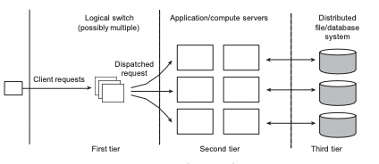
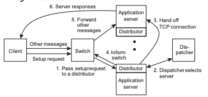

# Sistemas Distribuidos

## Capitulo 3

### Conceitos
* [Introducao a processos e threads]()
  * [Processos x Threads]()
* [Threads em sistemas distribuidos]()
  * [Threads no Cliente]()
  * [Threads no Servidor(dispatcher/worker)]()
* [Clientes]()
  * Interacao com o servidor
  * Transparencia de distribuicao
* [Servidores]()
  * Organizacao geral
  * [Stateless e stateful]()
* [Aglomerados de servidores: 3 camadas diferentes]()
  * [Load Balancer]()
* [Migracao de codigo]()
  * [Virtualizacao]()
* [Frontend e Backend]()


### Introducao a processos e threads
**Processo**: uma das abstracoes mais importantes de um SO; 
- representam a execucao de um programa; 
- composto por: IP, codigo, heap, stack, files, interrupt routines.
- execucoes simultaneas de um programa sao representadas por diversos processos
- por seguranca: os `espacos de memoria` de cada processo sao `isolados` -> evitando problemas que seriam causados por ataques deliberados ou por bugs
- Cada processo é uma linha de execucao independente gerenciada pelo SO

**Threads**: frequentemente um mesmo processo precisa fazer mais de uma coisa por vez. Exemplo: navegador de Internet
- da mesma maneira que processo fornecem multiplas linhas de execucao em uma maquina, threads permitem _multiplas linhas de execucao em um só processo_.
- Como todas as threads estao no mesmo processo, todas tem acesso ao mesmo espaco de memoria e a todos os recursos disponiveis no processo.

#### Processos x Threads
* SO prove mecanismos para dividir o tempo do processador entre processos e threads, gerenciando-os nas unidades de processamento disponiveis. Bloqueios por alguma operacao de E/S causam uma troca do processo/thread pelo proximo da fila
* Trocas de contexto entre threads sao baratas; basta trocar o IP e mais alguns registradores
* Trocas de contexto entre processos sao mais caras; pois exigem troca da tabela de paginas, troca de IP, troca de rotinas de manuseio de interrupcoes.

| pode surgir a duvida, usar um processo muitas threads, varios processos com muitas threads, um processo com uma thread? Tudo depende mas ainda assim ha momentos que o suso de processos pode ser preferivel por mais caro que seja, por questao de seguranca.

### Threads em sistemas distribuidos

Razoes para utilizar varias threads:
- Evita bloqueios: para programas com uma thread caso haja uma chamada a IO, o SO bloqueia a thread.
- Explora o paralelismo: em um programa multi-thread, podem ser executadas em paralelo em diversos processadores ou cores.
- Evita troca de contextos entre processos: leva a programacao concorrente com memoria compartilhada(feita pelo programador)

#### Threads no Cliente
**Clientes web multithreaded - escondem latencia da rede:**
- Navegador analisa a pagina HTML sendo recebida e descobre que muitos outros arquivos devem ser baixados. Cada arquivo é baixado por uma thread separada; cada uma realiza um requisicao HTTP(bloqueante). A medida que os arquivos chegam, o navegador os exibem

**Multiplas chamadas requisicao-resposa(RPC) para outras maquinas**
- Um cliente faz varias chamadas simultaneas, cada uma em uma thread diferente
- Ele espera ate que todos os resultados tenham chegado
- Se as chamadas sao servidores diferentes, voce pode ter um speed-up linear

#### Threads no Servidor(dispatcher/worker)
**Melhorias no desempenho**
- Iniciar uma thread é muito mais barato do que iniciar um novo processo
- Ter servidores single-threaded impede o uso de sistemas que possuem varios processadores(multi-core), nao tem problema de concorrencia
- Da mesma maneira que comentamos no cliente: esconda a latencia de rede reagindo a proxima requisicao enquanto a anterior esta enviando sua resposta.

**Melhorias na estrutura**
- a maioria dos servidores faz muita E/S. Usar chamadas bloqueantes simples e bem conhecidas simplifica o programa.
- programas multithreaded tendem a ser menores e mais faceis de entender, ja que simplificam o fluxo de controle

**Modelo dispatcher/worker**
Para tratar melhor usamos esse modelo.
Basicamente dentro de um processo no servidor, o cliente acessa o programa por meio de uma thread que somente escuta, e somente executa a requisicao em uma outra thread. Ou seja a thread que escuta é o `dispatcher` e as demais que executam a requisicao sao os `workers`.

### Clientes

#### Clientes: interacao com o servidor
Cliente se comunica com o servidor, mas tambem pode atuar como o servidor. Usando protocolos de aplicacao ou de middleware
- A maior parte dos softwares do lado do cliente é especializada em interfaces graficas de usuario
- O lado do servidor processa e armazena eventos


#### Clientes: transparencia de distribuicao
lembrando que o cliente nao quer saber onde esta localizado o servico
- `transparencia de acesso`: stubs do cliente para RPC(SOMENTE CABECALHO DO METODO)
- `transparencia de localizacao/migracao`: deixe o software cliente manter o controle sobre a localizacao atual
- `transparencia de replicacao`: multiplas evocacoes sao gerenciadas pelo stub do cliente, sem o uso do middleware, atuando como um middleware de replicacao. Nao tao simples de fazer
- `transparencia de falhas`: podem geralmente ser responsabilidade so do cliente(que tenta esconder falhas de comunicacao e do servidor)


### Servidores

#### Organizacao geral
Modelo basico: um processo que implementa um servico especifico em nome de uma colecao de clientes.
- Processo que espera a requisicao do cliente, garante que a requisicao sera tratada e em seguida passa a esperar a proxima requisicao.
- 2 tipos

**Servidores iterativos**: O servidor trata uma requisicao antes de atender a proxima. Por exemplo 3 clientes acessando o mesmo servidor, requisicoes colocadas em uma fila para tratar uma por uma.


**Servidores concorrentes**: usa um dispatcher, que pega uma requisicao e passa o seu tratamento para uma thread/processo separado

> É mais comum encontrarmos **servidores concorrentes**: eles podem tratar multiplas requisicoes mais facilmente, principalmente se for necessario realizar operacoes bloqueantes em discos ou outros servidores

Alguns processos bem definidos em portas. por exemplo ssh porta 22
Cada requisicao a uma porta é atribuida a um processo dinamicamente via superservidor(processo que inicia subprocesso para tratar a requisicao) ou daemos(processos que se registram em uma porta)

-> Assinando dinamemicamente, para acessar o ser vico no servidor:

Cada requisicao a uma porta é atribuida a um processo dinamicamente, via **Daemons**(processos que se registram em uma porta).
Exemplo: cliente quer acessar o servico1 no servidor, servidor registra a porta 8000 de acesso, ai o daemon vai registrar que na porta 8000 vai estar o servico1. Isso somente na primeira vez, pq ai todas as proximas vezes que o cliente acessar o servico1 ja vai ter a porta pra requisitar diretamente.

**Superservidor**
É diferente do daemon, que no daemon o server precisa estar disponivel antes de qualquer requisicao para registrar. Aqui o servico é levantado de forma dinamica. Porem para levantar pode levar um tempo

#### Stateless e stateful

**Stateless**
Nao mantem informacao exata sobre o status de um cliente apos ter processado uma requisicao.
Exemplo: pagina inicial sem logar no facebook, somente mostra informacoes genericas.
- Nao guarda se um arquivo foi aberto(simplesmente fecha-o e abre novamente se necessario)
- Nao promete invalidar o cache do cliente
- Nao rastreia os seus clientes: por exemplo quantas vezes acessou
- _Consequencias_
  - Clientes e servidores sao completamente independentes(evita coordenacao)
  - Inconsistencias de estado devido a problemas no cliente ou servidor sao reduzidas
  - Possivel perda de desempenho. Um servidor nao pode antecipar o comportamento, por nao ter o estado do cliente, por exemplo pode ter que fazer algo frequente do zero varias vezes.

O uso de comunicacao orientada a conexao viola o modelo stateless?
Comunicacao TCP entre cliente e Servidor viola? TCP mantem estado na camada de transporte.
Resposta: Nao viola, pois ha uma separacao de responsabilidade. Stateless nao mantem estado na camada de aplicacao.

**Stateful**
Servidores guaradm o status de seus clientes. Por exemplo home apos logar no facebook. Informacoes dos seus amigos, e suas informacoes.
- Regristam quando um arquivo foi aberto para realizacao de prefetching. Por exemplo se um arquivo é muito acessado, ao inves de abrir e fechar toda vez que requisitado, poderia deixar aberto economizando tempo.
- Sabem quando o cliente possui cache dos dados e permitem que os clientes mantenham copias locais de dados compartilhados.
- Desempenho de servidores stateful pode ser extremamente alto, desde que seja permitido que os cleintes mantenham copias locais dos dados. -> Nesse caso, confiabilidade nao é o maior problema e sim a consistencia. Porque poderia ter um cliente que modifica uma informacao, e o dado fique defasado.

#### Aglomerados de servidores: 3 camadas diferentes
Como colocar tudo isso em varias maquinas? com os conceitos anteriores

Varios clientes, mas vamos focar em um cliente que faz acesso a 1 ou mais maquinas na primeira camada fisica(**first tier**)(podem ser os loadbalancers e o apache) que realizam o dispatcher da requisicao para as maquinas da **second tier**(servidor com um processo que pode executar uma ou mais threads) que podem precisar acessar a *third tier* que seria o banco de dados.


*Tratamento de Requisicoes*
> Ter uma unica camada tratando toda a comunicacao de/para o aglomerado pode levar a criacao de um *gargalo*. Isso acontece porque volta pelo mesmo dispacher ate o cliente novamente   

**Solucao 1**
- seria usar o *TCP-handoff*: cliente manda requisicao para o dispachter que requisita o servidor mas nesse caso o servidor responde direto para o cliente, sem passar pelo dispatcher novamente. liberando o dispatcher. Mas o cliente espera uma resposta do dispatcher, e para isso o servidor para responder diretamente precisaria modificar o endereco para responder como se fosse o dispatcher, sendo assim fica de maneira transparente o acesso, como se fosse um sistema unico e coerente. Handoff nada mais é que deixar conexoes diferentes como se fosse a mesma conexao TCP para a transparencia de comunicacao com o cliente.

**Solucao 2**
- O `switch` da camada de transporte: frontend simplesmente redireciona a mensagem a um dos servidores(considerando metricas de desempenho). 
- `Distribuicao`: frontend seleciona o melhor servidor de acordo com conteudo da mensagem recebida. Servidor tem um pedaco de codigo _distributor_      
Funcionamento: Cliente manda uma requisicao de setup para o switch, que usa politica simples e manda para o middleware no servidor - distributor - que manda para o dispatcher, que ira analisar em qual servidor realmente deve ser direcionada a requisicao para o servidor mais adequado, por meio do uso do handoff tbm. e volta com a resposta para o switch que retorna para o servidor, ou seja tudo isso meio que cria o caminho usando um setup request, para quando for a real requisicao ja tenha as conexoes criadas para executar.


### Migracao de codigo

Por que migrar?
- **Distribuicao de carga**
  - Assegurar que os servidores do data center estao suficientemente carregados(para previnir perda de energia)
  - Minimizar a comunicacao assegurando que os computadores estao proximos aos dados. Por exemplo pra facilitar a transferencia de arquivos
- **Flexibilidade**: mover o codigo para o cliente quando necessario
  - algumas coisas poderiam ser executadas no cliente, por exemplo ordenar os dados do cliente


#### Abordagens para realizacao de migracao de codigo
[Slides de contexto][?]


#### Migracao em sistemas heterogeneos
Problema principal
- A maquina destino nao pode ser adequada para executar o codigo migrado
- A definicao de contexto/processo/processador é _altamente dependente do hardware, SO e libs locais_     
De alguma forma precisaria mudar tudo para conseguir rodar o codigo, e pode ser que sejam maquinas com SO diferentes. 
Nesse caso a unica solucao seria usar uma maquina abstrata que é implementada nas diferentes plataformas **MAQUINAS VIRTUAIS**

> **Virtualizacao** de uma maquina que mais se adeque ao contexto necessario, e essa maquina virtual pode ser migrada para qualquer maquina que seja adequada

Desempenho da migracao de VM, pode ter um problema secundario: uma migracao completa pode levar dezenas de segundos. Alem disso é preciso ficar atento ao fato de que um servico podera ficar indisponivel por varios segundos durante a migracao(_downtime_).


## Capitulo 4 - Comunicacao

### Conceitos
* [Fundamentos]()
* [Comunicacao orientada a procedimento RPC]()
* [Comunicacao orientada a mensagem MOM]()
* [RPC vs MOM]()
* [Comunicacao Multicast]()
  * [FIFO]()
  * [Causal]()
  * [Total]()
* Disseminacao de dados
  * [Gossip/Flooding]()
  * [Anti-entropy]()
* [Multicast vs Pub/Sub]()
* [Comunicacao orientada a fluxo]()

Comunicação transiente/persistente, assíncrona/síncrona.
• Comunicação RPC.
• Comunicação MOM (Event Streaming).
• Kafka.
• Multicast com ordem FIFO, Causal e Total.
• Comunicação Gossip: anti-entropy e rumor.

### Fundamentos

Protocolos em camadas
- camada de baixo nivel
- camada de transporte:tcp e udp
- camada do middleware: estaria no lugar das antigas camadas de presentation e session
- camada da aplicacao
- Tipos de comunicacao 

Modelo de comunicacao basico: OSI
Desvantagens:
- funciona apenas com passagem de mensagens
- frequentemente possuem funcionalidades desnecessarias
- viola a transparencia

> Em muitos SDs a interface de mais baixo nivel é a de transporte     
> **camada de transporte**: é importante por fornecer as ferramentas de comunicacao efetivamente utilizadas pela maioria dos sistemas distribuidos

Protocolos padroes na internet:
- TCP: orientada a conexao, confiavel, comunicacao orientada a fluxo de dados
- UDP: comunicacao de datagramas nao confiavel(best-effort)

Ip multicasting é normalmente considerado um servico padrao mas é uma hipotese perigosa

**Camada de middleware**
Acima da camada de transporte
- Prover servicoes e protocolos frequentemente usados que podem ser utilizados por varias aplicacoes diferentes
- Um conjunto rico de protocolos de comunicacao
- Desempacotamento de dados, necessarios para a integracao de sistemas
- protocolos de gerenciamento de nomes, para auxiliar o compartilhamento de recursos
- Protocolos de seguranca para comunicacoes seguras
- mecanismos de escalabilidade como replicacao e caching

Tirando esses protocolos o unico outro que teremos é o protocolo especificos de aplicacao

#### *Tipos de comunicacao*

Cliente manda uma requisicao para o servidor, mas primeiro quem recebe eé o middleware, o midleware armazena a mensagem caso caia a conexao antes de mandar para o servidor. O middleware avisa o cliente que recebeu a mensagem(1). Apos isso o middlware manda a mensagem para o servidor que por sua vez responde ao cliente que recebeu a mensagem(2), logo o cliente sabe o servidor esta processando a mensagem. (3) Depois de processar a mensagem o servidor responde e essa resposta tbm fica armazenada no middleware caso caia a conexao, e apos isso envia para o cliente a resposta do servidor.

1. **Transiente vs Persistente**
   - Isso de armazenar a request e response no middleware torna a comunicacao persistente, caso contrario seria transiente
   - `Transiente`: remetente descarta a mensagem se ela nao puder ser encaminhada ao destinatario
   - `Persistente`: uma mensagem é guardada no remetente pelo tempo que for necessario, ate ser entregue no destinatario
2. **Assincrona vs Sincrona**
   - pontos de sincronia: no envio da requisicao e na entrega(quando avisa o cliente 1 e 2) ASSINCRONO. Apos o processamento da requisicao(3) seria o SINCRONO

### Comunicacao orientada a procedimento RPC

**Funcionamento basico de RPCs**
RPC (Remote Procedure Call) em sistemas distribuídos é um mecanismo que permite a invocação de procedimentos ou funções em um computador remoto, como se fossem chamadas locais, ocultando a complexidade da comunicação entre os nós da rede. Em resumo, o RPC permite que um programa em um nó faça uma chamada a um procedimento em outro nó, como se fosse um método local.
- Transparência: O RPC oferece a ilusão de que a chamada ao procedimento remoto é uma chamada local. Isso significa que o programador não precisa se preocupar com os detalhes da comunicação em rede, tornando a interação entre os sistemas distribuídos mais transparente.
- Comunicação cliente-servidor: O RPC envolve uma relação cliente-servidor, onde o cliente faz uma solicitação para o servidor remoto executar um procedimento específico e aguarda a resposta.
- Linguagem de programação: RPC permite que procedimentos escritos em diferentes linguagens de programação sejam chamados de forma transparente em sistemas heterogêneos
- Protocolos de comunicação: Os RPCs geralmente são implementados usando protocolos de comunicação padrão, como TCP/IP, que garantem a confiabilidade e a entrega das mensagens entre os nós.
- Mapeamento de procedimentos: É necessário definir um mapeamento claro entre os procedimentos locais e os remotos, geralmente especificado por um ID de procedimento e tipos de dados de entrada e saída.
- Desenvolvedores estao familiarizados com o modelo de procedimentos
- Procedimentos bem projetados operam isoladamente(black box) - modular basta os parametros
- Entao podemos executar esses procedimentos em maquinas separadas
- Conclusao: a comunicacao entre o chamador e chamado podem ser escondida com o uso de mecanismos de chamada a procedimentos RPC
- o RPC é uma abstração poderosa para facilitar a interação entre sistemas distribuídos, permitindo que os desenvolvedores se concentrem na lógica de negócios, enquanto a complexidade da comunicação entre os nós é tratada pelo mecanismo de RPC.

Maquina cliente com o processo e chama um metodo1, client stub é chamado(casca do metodo), o stub constroi a mensagem, chama o SO local, SO envia a mensagem para o server stub. Stub desempacota parametros e chama o servidor. Servidor realiza chamada local e devolve resultado para o stub servidor, a volta acontece da mesma forma


_Passagem de parametros_      
Empacotamento de parametros: ha mais do que apenas coloca-los nas mensagens
- As maquinas cliente e servidor podem ter representacoes de dados diferrentes
- Empacotar um parametro significa transformar um valor em uma sequencia de bytes
- Cliente e servidor precisam concordar com a mesma regra de codificacao(encoding): como os dados simples e complexos sao representados?
- Cliente e servidor precisam interpretar corretamente as mensagens transformando seus valores usando representacoes dependentes da maquina
- Seria a camada de apresentacao responsavel, ou seja muitas vezes o middleware que ficara responsavel por essa passagem de parametros
- Algumas suposicoes:
  - semantica copy in/copy out: enquanto um procedimento é executado, nada pode ser assumido sobre os valores dos parametros
  - **Todos** os dados sao passados apenas por parametro. Exclui passagem de referencias para dados(globais)

`Conclusao`: nao é possivel assumir transparencia total de acesso


_Tipos de comunicacao_         
A comunicacao RPC é em sua maioria **assincrona**:      
Ideia geral: tentar se livrar do comportamento estrito requisicao-resposta, mas permitir que o cliente continue sem esperar por uma resposta do servidor
- Cliente faz a chamada pelo metodo ao servidor, o servidor imediatamente responde que recebeu a chamada e processa, mas nao precisa ter uma resposta

**Sincrono diferido**:
Cliente espera a resposta do resultado; precisa de uma interrupcao cliente e avisa o servidor[?]

_Variacao_: Cliente pode realizar uma consulta poll(bloqueante ou nao) para verificar se os resultados estao prontos, e so assim quando estiver pronto envia a resposta ao cliente

> O que acontece quando varios clientes acessam o metodo? Depende da implementacao, mas normalmente utiliza-se o **modelo dispatcher/worker**. Ou seja cada requisicao do cliente é atendida por uma thread diferente. Isso quer dizer que é necessario proteger as variaveis e estruturas de acesso concorrentes.


*********[COMO ESTUDAR A IMPLEMENTACAO JAVA?]*********

### Comunicacao orientada a mensagem MOM

Um tipo de middleware.
<u>Comunicacao assincrona(desacoplado na referencia) e persistente</u> gracas ao uso de filas pelo middleware.

> Filas: buffers em servidores de comunicacao

- **Middleware orientado a filas**    
  Podendo ter o padrao FIFO, first in first out.    
  Teremos tambem a possibilidade de uso de metodos    
  | Metodo | Descricao |
    |--- |--- |
    | PUT| Adiciona uma mensagem a fila especificada | 
    | GET | Bloqueia/espera ate que a fila especificada tenha alguma mensagem e remove a primeira mensagem | 
    | POLL | Verifica se a fila especificada tem alguma mensagem e remove a primeira, nunca bloqueia/espera| 
    | NOTIFY | Instala um tratador para ser chamado sempre que uma mensagem for inserida em uma fila | 

    _Gerenciadores de filas_: filas sao gerenciadas pelos `queue managers`. Uma aplicacao insere mensagens em uma fila local. Obter uma mensagem é possivel extraindo-a tambem da fila local somente queue managers precisam de roteamento(se estiver em outra maquina, overlay)

Sistemas de filas assumem um protocolo comum de troca de mensagens: todas as apps usam o mesmo formato de mensagem(i.e estrutura e representacao de dados)

- **Message broker**: componente centralizado que lida com heterogeneidade das aplicacoes(intermedia entre aplicacoes independentes e nao relacionadas)
  - Transforma as mensagens recebidas para o formato apropriado
  - Frequentemente funciona como um application gateway(ou seja a aplicacao nao precisa fazer parte do middleware)
  - podem rotear com base no conteudo = Enterprise Application Integration. Por exemplo nao somente analisa o IP e porta de destino onde tem que enviar, mas tambem o conteudo por exemplo se for sobre esportes direciona para o certo processo.
  
- Exemplos
  - [IBM WebSphere MQ] -> ???
  - [ApacheMQ]: middleware de comunicacao por mensagens que integra varias linguagens. Java <-> python
    - `Modelo ponto a ponto(queue)`: Cliente1 envia uma mensagem para uma fila e quando algum client2 se conecta vai consumir a mensagem da fila, porem somente um dos consumidores vai consumir a mensagem. Pode ser importante quando tem uma tarefa e so precisa que um consumidor realize a tarefa.
    - `Modelo Pub/Sub`: espaco de dados compartilhados, todos os componentes inscritos na fila recebe a mesma mensagem. Topico é a fila que todos os subs recebem. O producer enviar uma mensagem para o topico e todos com consumers que estao escutando recebem a mensagem

### RPC vs MOM
A comunicação orientada a mensagem (MOM - Message-Oriented Middleware) e a comunicação por RPC (Remote Procedure Call) são duas abordagens distintas para facilitar a comunicação entre sistemas distribuídos. Vamos destacar as principais diferenças entre elas:

1. Paradigma:
* RPC: O RPC segue o paradigma de comunicação cliente-servidor, onde um cliente faz uma chamada de procedimento em um servidor remoto, aguardando a resposta do servidor. A comunicação é baseada na invocação direta de funções ou procedimentos entre os sistemas.
* MOM: A comunicação orientada a mensagem não está restrita ao modelo cliente-servidor. Nesse paradigma, os sistemas trocam mensagens assincronamente através de uma camada intermediária (middleware), sem a necessidade de saber a identidade do destinatário ou mesmo se o destinatário está ativo no momento da comunicação.
  
1. Comunicação Assíncrona vs. Síncrona:
* RPC: A comunicação por RPC é síncrona, ou seja, o cliente aguarda a resposta do servidor antes de prosseguir com a execução. Enquanto a chamada de procedimento estiver em andamento, o cliente fica bloqueado.
* MOM: A comunicação orientada a mensagem é assíncrona. As mensagens são enviadas para uma fila de mensagens (ou tópico) e podem ser lidas por múltiplos destinatários quando estiverem disponíveis. Não há bloqueio esperando por uma resposta imediata.
  
1. Dependência Direta:
* RPC: No RPC, o cliente precisa conhecer a interface e a localização do servidor com o qual deseja se comunicar. É uma abordagem mais direta e acoplada.
* MOM: Na comunicação orientada a mensagem, o remetente da mensagem não precisa conhecer os detalhes específicos do destinatário. Ele envia a mensagem para um tópico ou fila, e o middleware é responsável por encaminhá-la para os destinatários apropriados. Isso promove um desacoplamento entre os sistemas.
 
1. Padrão de Mensagens:
* RPC: As mensagens em RPC geralmente incluem a identificação do procedimento a ser chamado e os parâmetros da função. A resposta pode incluir o resultado da chamada do procedimento.
* MOM: As mensagens na comunicação orientada a mensagem podem ser estruturadas de várias maneiras. Elas podem conter informações sobre o conteúdo da mensagem, ação a ser executada ou qualquer outra informação relevante.

Ambas as abordagens têm seus usos adequados, dependendo dos requisitos específicos do sistema distribuído. O RPC é mais adequado para comunicação direta e síncrona entre sistemas, enquanto a comunicação orientada a mensagem é mais adequada para cenários assíncronos e desacoplados, onde os sistemas não precisam conhecer detalhes uns dos outros.


### Comunicacao Multicast
Node que quer disseminar informacoes para diversos nodes de um _mesmo grupo_.
- Diferente do unicast(TCP) no multicast o emissor - sender - envia a mesma mensagem para um grupo de destinos - receivers.
- O multicast pode ser realizado pela camada de rede(dificil de ser implementado) ou pelo middleware
- Pelo middleware cabera a este verificar que as mensagens sejam entregues aos destinos

_Multicast de nivel de aplicacao(ALM):_
Organizar os nodes de um SD em uma rede overlay e usa-la para disseminar os dados. Caso de uso: 3 nodes(compoem o middlware), um cliente faz uma atualizacao em um node e o ideal seria replicar em todos os nodes.
- Geralmente em uma arvore levando a caminhos unicos. Ou em uma _rede mesh_(sem estrutura, pode ser atraves dos vizinhos, porem pode ter uma duplicacao pois nao tem uma raiz unica) mas precisa de roteamento


Broadcast: camada de rede e enlace

O multicast pode ter diferentes configuracoes de ordem.

#### Ordem FIFO
_Se um processo P envia mensagens M1 e depois M2, todos os processos entregarao primeiro M1 antes de M2._
- No middleware:
    - Receber: nao ha controle sobre o que se recebe pela camada de rede
    - Entregar/repassar: apos receber a mensagem, voce controla o que fazer com ela, por exemplo entregar para o banco de dados e fazer o update
  
#### Ordem Causal
Se uma mensagem M1 _precede causalmente_ M2, todos os processos entregarao primeiro M1 antes de M2.
Note que não depende do processo origem que enviou o multicast.

#### Ordem Total
_Se um processo entrega m1 antes de m2, todos os processos entregarão nessa mesma ordem._

### Disseminacao de dados

**Protocolos Epidemicos**
- _Assuma que nao ha conflito escrita-escrita_
  - Operacoes de atualizacao sao realizadas em um so servidor
  - Um node passa informacoes(estado) a somente alguns nodes
  - Propagacao de atualizacoes é lenta, nao imediata.
  - Eventualmente, cada atualizacao atingira cada node
- _Duas formas de epidemia_
  - `Anti-entropy`: cada node regularmente escolhe outro node aleatoriamente e intercambia seu estado, levando a estados identicos.
  - `Rumor(gossip)`: um node que foi atualizado, ou seja contaminado, avisa outros nodes sobre a atualizacao, contaminando-os. A diferenca é que nao manda para o node que ja sabe.


#### Gossip/Flooding
Node P envia uma mensagem M a seus vizinhos via _gossiping_. Cada vizinho a re-envia (via _flooding_ se nao a viu antes)
- Desempenho: maior a quantidade de conexoes mais caro fica
- um node S com uma atualizacao a disseminar, contata outros nodes. Se o node contatado ja possui a atualizacao, S para de contatar outros nodes com probabiliadade pstop.
- Gossip pode faltar um a receber, anti-entropy nao.
- Se realmente quer ter ctz de atualizar todos os nodes, o gossip por si só nao é suficiente
- _Remocao de dados:_ Nao eh possivel remover um valor antigo de um node e esperar que isso se dissemine. Pelo contrario, a remocao sera desfeita pelo uso do algoritmo epidemico(problema)
- A remoção deve ser registrada como uma atualização “especial” usando um `death certificate`

**GOSSIP CODE**
```python
Node N #node, thread, ou processo
    n.run()
        while True: #Método main executado por Node n
            sleepMs(x)
            executeGossip() #Cada certo tempo acorda e faz algo (gossip)
    
    n.executeGossip():
        p = selectNode()
        infoLocal = getLocalInfo()
        p.shareInfo(infoLocal, n) #compartilha via RPC para o node p
    
    n.shareInfo(info, q): # Orientado a evento (muitos Nós podem chamá-lo ao mesmo tempo)
        addInfo(info)
        infoLocal = getLocalInfo()
        q.updateInfo(infoLocal) #Via RPC ao Nó q

    n.updateInfo(info): #Orientado a evento (muitos Nós podem chamá-lo ao mesmo tempo)
        addInfo(info)
```


#### Anti-entropy
- Um node P seleciona outro node Q do sistema aleatoriamente
- _Pull_: P somente pede novas atualizacoes de Q
- _Push_: P somente envia novas atualizacoes a Q, sem Q ter pedido
- _Push-pull_: P e Q enviam atualizacoes um ao outro. `O(log N)` rodadas para disseminar as atualizacoes nos n NODES


### Multicast vs PuBsUB
Tanto a comunicação multicast quanto o modelo pub/sub são utilizados para distribuir informações para vários clientes em sistemas distribuídos, mas possuem abordagens diferentes:

**Comunicação Multicast:**

* Mecanismo de distribuição: Na comunicação multicast, um remetente envia uma única mensagem que é entregue a vários destinos simultaneamente. É como se o remetente "transmitisse" a mensagem para um grupo de receptores ao mesmo tempo.
* Grupos de destino: Os receptores, também conhecidos como "membros do grupo", precisam ser parte de um grupo multicast específico para receber a mensagem. O remetente envia a mensagem para um endereço de multicast específico, e apenas os membros desse grupo receberão a mensagem.
* Comunicação ponto a multiponto: O multicast permite a comunicação ponto a multiponto, onde uma única mensagem é entregue a vários destinatários.    

**Modelo Pub/Sub (Publicação/Assinatura):**

* Mecanismo de distribuição: No modelo pub/sub, os remetentes, conhecidos como "publicadores", enviam mensagens para um canal (tópico) específico, sem a necessidade de saber quais são os destinatários. Os destinatários, conhecidos como "assinantes", se inscrevem nos canais (tópicos) de seu interesse.
* Inscrição nos canais: Os assinantes se inscrevem nos canais (tópicos) que desejam receber mensagens. Os publicadores enviam mensagens para esses canais, e todas as mensagens enviadas para um canal são entregues a todos os assinantes desse canal.
* Comunicação um-para-muitos: O modelo pub/sub permite a comunicação um-para-muitos, onde uma única mensagem enviada por um publicador é entregue a todos os assinantes inscritos no canal correspondente.    
  
**Principais diferenças:**
* Abordagem: O multicast é uma abordagem mais orientada à rede, onde os destinatários precisam estar em grupos específicos para receber a mensagem. No pub/sub, os destinatários se inscrevem nos canais de interesse e não precisam estar em grupos específicos.
* Identificação do destinatário: No multicast, o remetente precisa saber os endereços multicast dos grupos de destino para enviar a mensagem corretamente. No pub/sub, o remetente não precisa saber quem são os destinatários; ele simplesmente envia a mensagem para um canal específico, e o middleware se encarrega de entregá-la aos assinantes interessados.
* Escalabilidade: O modelo pub/sub é mais escalável em ambientes onde os assinantes podem ser dinamicamente adicionados ou removidos sem afetar os publicadores. No multicast, o remetente precisa conhecer e lidar com os grupos de destino e seus membros.
* Flexibilidade: O modelo pub/sub é mais flexível, pois permite que os assinantes escolham os tópicos específicos de interesse e recebam apenas as mensagens relevantes para eles. O multicast envia a mesma mensagem para todos os membros do grupo, independentemente de seu interesse em mensagens específicas.
> Em resumo, enquanto o multicast é mais orientado à rede e requer que os destinatários estejam em grupos específicos, o modelo pub/sub é mais flexível, permitindo que os destinatários se inscrevam nos canais (tópicos) de interesse e recebam mensagens relevantes para eles. Ambas as abordagens têm seus usos e vantagens dependendo das necessidades do sistema distribuído.


### Comunicacao orientada a fluxo(streams)
- **Suporte para midia continua**(caracterizada por ter valores dependentes do tempo), podem ser sensores que mandam informacoes continuas, audio, video, animacoes
  - Toda comunicacao apresentada foi baseada em um intercambio de informacao discreto e independente do tempo
  - Transmitir informacoes com diferentes garantias de tempo:
    - `Assincrona`: sem restricoes de quando o pacote deve ser entregue
    - `Sincrona`: define um delay(end-to-end) maximo para a entrega do pacote
    - `Isochronous`: define um delay maximo e minimo para a entrega do pacote(jitter)
  
- **Fluxo em sistemas distribuidos**
Um fluxo continuo de dados é uma comunicacao orientada a conexao que suporta transmissao de dados _Isochronous_
  - Fluxos sao unidirecionais
  - Geralmente uma unica fonte de informacao
  - Fluxo simples: unico fluxo de dados por exemplo audio OU video
  - Fluxo completo multiplos fluxos de dados, audio E video
    
- **Qualidade de servico(QoS)**
  - Dependendo do dispositivo muda a qualidade
  - Bit rate: requerido no transporte
  - Delay máximo até criar a sessão (i.e., quando a aplicação pode começar a enviar dados).
  - Delay máximo do jitter
- Os pacotes podem ser priorizados por ferramentas inseridas na camada de rede(buffers por exemplo)
- Problema
    - Como reduzir o efeito de pacotes perdidos usando UDP (quando múltiplos quadros estão em um mesmo pacote)?
      - > Retransmissão seletiva, onde o receptor solicita apenas os quadros perdidos em um pacote. 