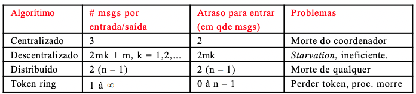

# Sistemas Distribuidos

## Capitulo 5 - Naming

### Conceitos
* [Definicoes: nomes, identificadores e endereços]()
* [Resolucoes de nomes]()
  * [Plano]()
    * [Flooding]
    * [DHT e fingertables]
  * [Estruturado]()
    * [DNS]
  * [Atributo]()


### Definicoes: nomes, identificadores e endereços


**Nomes**: sao usados para denotar entidades(endereco de rede, servico web,..) em um sistema distribuido. Para realizar operacoes em uma entidade é preciso ter acesso a ela por meio de um `ponto de acesso`(_endereco_, por exemplo IP e porta). Nomes sao independentes de onde a entidade esta localizada, p.e URL


**Identificadores**
_Nomes puros ou planos_: sao nomes que nao tem significado proprio, sao strings aleatorias. Nomes puros podem ser usados apenas para comparacao.

_Propriedades do Identificador_: 
- Cada identificador se refere a no maximo uma entidade. ID literalmente
- Cada entidade é referenciada por no maximo um identificador
- Um identificador sempre se refere a mesma entidade(nao ha reutilizacao de identificadores)
- Obs: Um identificador nao necessariamente precisa ser um nome puro(pode ter conteudo) - nao precisaria ser aleatorio

### Resolucoes de nomes

Como procurar o acesso ao recurso, dado um nome plano?
#### Plano
Problema: Dado um nome nao estruturado(ex: um identificador), como localizar seu ponto de acesso?   
_3 solucoes: Simples(broadcast/flooding/ponteiros), home-based, DHT, HLS._
1. Solucao Simples(broadcasting/flooding/ponteiros)
   - **Broadcasting**: fazer o broadcast(todos os nos da rede) do ID, requisitando que a entidade devolva seu endereco
     - Nao escala para alem de _redes locais_
     - Requer que todos os processos escutem e processem os pedido de localizacao
     - ARP(Address Resolution Protocol): para encontrar o endereco MAC associado a um IP, faz o broadcast da consulta "quem tem esse endereco IP?"

   -  **Flooding**: um node X envia requisicao R por um arquivo A a alguns vizinhos V. O node V recebe e realiza o seguinte processo
   -  Problema de Escalabilidade pode chegar a mesma informacao de nodes diferentes(de tamanho e geográfica), pois pode demorar se estiver em outro pais TTL. Para tentar conter isso o ideal seria usar o flooding com um limite usando o TTL para a mensagem, baseado em saltos, ou seja "so pode saltar 2", 2 nodes
```python
      -  Se V ja viu a req antes, a ignora
      -  V procura localmente por A
      -  Se V nao tem o arquiv:
         -  Se o TTL da requisicao > 0
            -  Encaminha R para um dos seus vizinhos com TTL-1
      - Se V tem o arquivo:
        - Devolve diretamente para X ou devolve para quem faz(encaminhou) a rquisicao
```
GNUTELLA - FLOODING
```python
    Se V nao tem o arquivo:
        Encaminha para 7 vizinhos com TTL = 10
    Se V tem o arquivo:
        responde de forma inversa pelo mesmo caminho
    # nao ha loop nas requisicoes, pois sabe por quais nodes passou
    # transferencias sao realizadas diretamente entre nodes via HTTP
    # MESMO TENDO UMA AREA LIMITADA, FUNCIONAVA, baseando na popularidade dos arquivos, replicando dentro da area
         
```

   -  **Ponteiros**: quando uma entidade se mover ela deixa pra tras um ponteiro para sua nova localizacao
      -  O dereferenciamento pode ser automatico e invisivel para o cliente, basta seguir a sequencia de ponteiros
      -  Atualize a referencia do ponteiro quando o local atual for encontrado
      -  Problema de escalabilidade geografica(que podem requerer um mecanismo separada para reducao da sequencia)
         -  Sequencias longas `nao sao tolerantes a falha, ou seja se um node morrer, ja era o caminho de referencia`
         -  `Maior latencia` de rede devido ao processo de dereferenciamento


2. Abordagens baseadas em um local pre-determinado(home-based) - procurar em local pre-determinado
- Faca com que um local fixo sempre saiba onde a entidade esta
- Endereco pre-determinado é registrado em um servico de nomes
- Endereco mantem um registro do endereco externo da entidade
- O cliente primeiro contata o endereco pre-determinado e depois continua para seu endereco externo(atual)
- Abordagem em dois niveis:
  - Mantenha um registro das entidade que foram visitadas: verifique o endereco local primeiro, se falhar so entao va para o endereco pre-determinado
- Problemas:
  - O endereco pre-determinado deve existir enquanto a entidade existir 
  - O endereco fixo pode se tornar desnecessario se a entidade se mover permanentemente -> SOLUCAO DNS
  - Escalabilidade geografica ruim(entidade pode estar do lado do cliente ou nao, e a home pode ser longe, e sempre deve passar pela home,delay)


3. Tabelas de hash distribuidas(P2P Estruturado) - DHT - chave/valor
- `Chord`: considere que os nodes estejam em forma de anel logico, sucessor e predecessor
  - A cada nó é atribuído um identificador aleatório de m-bits. Cada node um numero
  - A cada entidade é atribuída uma única chave de m-bits
  - Entidades com chave k estão sob a jurisdição do nó com o menor    
id ≥ k (seu sucessor)   
Exemplo: arquivo a.mp4    
hash(a.mp4) = 7 = k   
No anel vai armazenar  com vase na regra id >= k    

- _Busca por uma informacao: solucao ruim_    
Faca com que cada node mantenha o registro de seus vizinhos e faca uma busca linear ao longo do anel (SUCESSO PARA SUCESSOR)
- _NOTACAO_: chamamos de node P o node cujo identificador é P
- Para melhorar o desempenho da busca: `SHORTCUTS` = `FINGERTABLES` diferente em cada node
  - Esses shortcuts sao ligacoes com outros nodes nao necessariamente sequenciais no anel
   - Cada node P mantem um array shortcut FTp [] com no maximo m entradas
   - [Formula FTp[i]] => FTp [i] = succ(p + 2^i−1)
   - FTp[i] aponta para o primeiro node que sucede P com distancia de pelo menos 2^i-1 posicoes (distancia 2^1, 2^2 ....)
   - Para procurar por uma chave k, o nó P encaminha o pedido para o
nó com índice j tal que: q = FTp [j] ≤ k < FTp [j + 1]
   - Se p < k < FTp [1], a requisição é encaminhada para FTp [1]
     - Entre os nodes
- DHTs: Exploracao de proximidade da rede:
  - Problema: a organizacao logica dos nodes em uma rede overlay pode levar a transferencia de mensagens de forma erratica na internet: os nodes K e succ(k+1) podem estar muito longes um do outro
  - Solucoes:
    - Atribuicao ciente da rede: ao atribuir um ID ao node, assegure-se de que os nodes proximos no espaco de enderecamento estao proximos na rede real. Pode ser muito complicado, por muitas vezes o SD nao ter acesso a camada fisica
    - Roteamente de proximidade: mantenha mais de um sucessor possivel e encaminhe a mensagem para o mais proximo. Exemplo no Chord , FTp[i] aponta para o primeiro node em INT = [p + 2^i-1, p+2^i - 1]. O node p pode guardar tambem ponteiros para outros nodes em INT
    - Selecao de vizinho por proximidade: quando houver uma escolha para determinar quem sera seus vizinho, escolha o mais proximo

4. Servicos hierarquico de nomes(HLS)   
- Arvores distribuidas
- Ideia: Construir uma arvore de busca em larga escala onde a rede é dividida em domínios hierárquicos. Cada domínio é representado por um diretório de nós separado.

- So tem um caminho pra chegar, mas se um node morre morre toda uma estrutura. Podemos criar subdominios dentro do dominio, identificadores aleatorios. Subdominios podem ser criados usando areas geograficas, para ter conexoes rapidas.

**HLS: organização em árvores**
- _Invariantes_: endereco da entidade E é armazenado em uma folha ou node intermediario
- Nodes intermediarios contem um ponteiro para um filho se a subarvore cuja raiz e o filho contenha o endereco da entidade 
- A raiz conhece todas as entidades

**HLS: consulta**
- Comece a busca pelo node folha local
- Se esse node souber sobre E(recurso que deseja achar), seguir o ponteiro para baixo, se nao, continue a subir
- Continue subindo ate encontrar a raiz

**HLS: insercao**
- Um pedido de insercao é encaminhado ao node folha que conhece a entidade E
- Primeiro verifica se existe E em alguma parte da estrutura, nao pode simplesmente inserir


#### Estruturado

Nome estruturado, nao é uma string aleatoria, ou seja possivel de leitura por pessoas. www.google.com.br

- Geralmente representado como um grafo no qual um node folha representa uma entidade que tem um nome.
- Diretorio de nodes é uma entidade que se refere a outros nodes
- hierarquia de nomes na arvore(diferenca do anterior)
- A resolucao de um nome é um mecanismo para recuperar a entidade que possui o nome
- `Problema`: Para resolver um nome precisamos de um diretorio. Como encontrar esse node raiz inicialmente? 
  - Mecanismo de closure: inicia em um servidor DNS, cmcc.ufabc.edu.br -> raiz

**DNS: Implementacao de espacos de nomes**    
- Problema: Distribuir o processo de resolução de nomes, bem como o gerenciamento do espaço de nomes, em várias máquinas, de forma a distribuir o grafo de nomes para garantir escalabilidade e disponibilidade.
- Um dos primeiros SDs implementados - Nome a um IP

**Distribuicao**
_Tres niveis distintos_
1. `Nível global`: consiste de um diretório de nós de alto nível. Suas principais características são que os nós do diretório devem ser gerenciados em conjunto por diferentes administradores e que há uma relativa estabilidade nos nomes, ou seja, as entradas do diretório são modificadas muito raramente
2.  `Nível de administração`: nós de diretório de nível intermediário. Podem ser agrupados e cada grupo pode ser responsabilidade de um administrador diferente. Apesar de estáveis, mudam com mais frequência do que entradas no nível global(normalmente por cada pais)
3. `Nível gerencial`: nós de nível inferior que pertencem a um único
administrador. O problema principal é mapear os nós de diretório aos
servidores de nomes local. Mudanças regulares ocorrem neste nível.(por exemplo .ufabc)

**Comparacao**

|Item|Global|Administracao|Gerencial |
| ------- | ------- | ------- |------- |
| Escala geografica| Mundial | Organizacao | Departamento|
| Nos | Poucos | Muitos | Qunatidades enormes|
| Responsividade | Segundos | Milissegundos | Imediato | 
| Propagacao de atualizacoes | Tardio | Imediato | Imediato |
| Replicas | Muitos | Nenhum ou poucos | nenhum | 
| Cache no lado do cliente | Sim | Sim | As vezes |


**DNS: Resolucao de nomes ITERATIVA**   
Camada por camada ate encontrar o nome.
- Cliente envia resolve(dir,[name1,.., namek=K]) para ServerRaiz responsavel por dir. = Procure no diretorio
- Server0 resolve(dir, name1) -> dir1, ddevolve a identificacao(IP) de Server1 que contem dir1.
- Cliente envia resolve(dir1,[name2,.., namek=K]) para Server1, etc

**DNS: Resolucao de nomes RECURSIVA**   
Ao inves de retornar e acumular as referencias ate achar totalmente as informacoes, faz uma busca recursiva. Qualquer duvida olhar desenho da aula em video. Manda a informacao para o node raiz e ai o node raiz se vira ate obter todas as referencias do endereco completo e retornar uma unica vez ao cliente.
- Cliente envia resolve(dir,[name1,.., namek=K]) para ServerRaiz responsavel por dir. = Procure no diretorio
- Server0 resolve(dir, name1) -> dir1, e envia resolve(dir1,[name2,.., namek=K]) para Server1, que contem dir1
- Server0 espera pelo resultado de Server1 e devolve para o cliente

**DNS: Problema de Escalabilidade**   

_Escalabilidade de tamanho_: Devemos garantir que os servidores possam lidar com um grande numero de requisicoes por unidade de tempo. Servidores alto nivel podem estar com problemas serios.
`Solucao`: Assuma (pelo menos nos níveis global e de administração) que os conteúdos dos nós mudam muito pouco. Assim podemos aplicar replicação extensivamente, mapeando nós a múltiplos servidores e começar a resolução de nomes no servidor mais próximo.
_OBS_: Um atributo importante em muitos nodes é o endereco(onde a entidade pode ser localizada). Replicacao faz com que servidores de nomes em larga escala sejam inadequados para localizar entidades moveis.

_Escalabilidade Geografica_: Precisamos garantir que a resolucao de nomes escale mesmo em grandes distancias geograficas. Provavelmente seria bom utilizar a resolucao recursiva nesse caso por estar no mesmo dominio, proximos geograficamente.
- Porém:
Ao mapear nós em servidores que podem ser localizados em qualquer lugar, nós acabamos introduzindo uma dependência de localização implícita. Pode nao ser tao trivial saber a localizacao para tratar isso.


#### Nomeacao baseada em atributos

- Em muitos casos, é mais conveniente nomear e procurar entidades pelos atributos => servicos tradicionais de diretorios(ex: paginas amarelas)
- Problema: Operações de consulta globais podem ser muito caras(nao poderia ser feito, muito custoso), já que necessitam que os valores dos atributos procurados correspondam aos valores reais das entidades. Em princípio, teríamos que inspecionar todas as entidades.
`Solucao`: Implementar serviços de diretórios básicos locais (tais como bancos de
dados) e combiná-los com os sistemas de nomes estruturados tradicionais.


**Implementando um servico de diretorio**
Solucao para uma busca escalavel: Implementar um servico com diversos bancos de dados locais, combinando-o com o DNS

**LDAP -  Uma das implementacoes**
Cada entrada do diretório consiste em um par (atributo, valor), unicamente nomeado para facilitar as buscas. Organizados de forma hierarquica

## Capitulo 6

### Conceitos - Coordenacao
* [Exclusao mutua]()
  * [Permissao]
    * [Centralizado]
    * [distribuido] 
  * [token]
  * [decentralizado]
* [Eleicao]()
  * [Anel]
  * [Bully]

Problemas que devem ser tratados em sistemas distribuidos
### Exclusao mutua
Varios dispositivos que precisam acessar um recurso, mas somente um pode acessar.
`Problema`: Alguns processos em um sistema distribuido querem acesso exclusivo a algum recurso

_Solucoes_
- **Baseado em permissao**: um processo que quiser entrar na secao critica(ou acessar um recurso) precisa da permissao de outros processos

1. **Permissao: Centralizado**    
- Node responsavel por dar a permissao: _coordenador_
  - Processo P1 pede permissao ao coordenador para acessar o recurso compartilhado. Verificara na fila em sua memoria para verificar se alguem ja pediu, fila vazia -> permissao concedida
  - Processo P2 tambem quer acessar o recurso, coordenador sabe que P1 ja pediu -> recurso ja emprestado -> o coordenador nao responde, e coloca em sua fila quem pediu e nao deu(P2)
  - Quando P1 libera o recurso, avisa o coordenador, e o coordenador finalmente responde para P2 -> permissao concedida
  - _Possiveis problemas:_ `Poderia acontecer de P1 nao entregar a mensagem liberando o recurso`, poderia acontecer de `o coordenador morrer`. Poderia ter `problema de escalabilidade de tamanho`, travando o recurso.

2. **Permissao: Distribuido**
- O processo que precisa do recurso envia uma requisicao de permissao a todos os outros processos(inclusive para ele mesmo)
   - A resposta a permissao(denominada de ACK) é enviada quando:
     - O processo receptor nao tem interesse no recurso compartilhado ou
     - o processo receptor está esperando por um recurso, mas tem menos prioridade (a prioridade é `determinada via comparaçao de timestamps*`)
   - Em todos os outros casos, o envio da resposta é adiado.
   - * timestamp é o horário do relógio ou um valor (e.g., contador).
   - Exemplo: 3 processos com identificadores 0,1,2 e proprio ts. 
     - Dois processos P0 e P2 querem acessar um recurso compartilhado ao mesmo tempo
     - P0 e P2: manda o seu ts para todos e para ele mesmo
     - P1 nao tem interesse no recurso entao manda ACK(permissao para os outros nodes)
     - P0 tem o menor timestamp; logo tem maior prioridade, entao o P2 que manda ACK(OK) para P0.
     - P0: recebeu OK dele mesmo, do P2 e do P1: 3 OK pode acessar o recurso
     - P2: recebeu 2 OK, nao pode ainda acessar
     - P0: acessou e liberou o recurso, respondendo OK para P2
     - P2: 3 permissoes, pode acessar o recurso

- **Baseado em tokens**: um token é passado entre processos. Aquele processo que tiver o token pode entrar na secao critica ou passa-lo para frente quando nao tiver interessado.
  - Organizar os processos em anel logico e passar um token entre eles. Aquele que estiver token pode entrar na secao critica(se ele quiser) = overlay logica de conexoes
  - Anel:
    - Algum deles tem um token node 0
    - Node 0 usa o token e o recurso e passa o token para n1
    - n0 nao poderia mais usar, somente n1
    - n1 nao quer acessar e passa o token para n2
  - Possiveis problemas: Se morre um node perde o token
  - Cenario de que nenhum node quer somente o 7, porque nao passar direto ao inves de ir de sucessor em sucessor?

- **Descentralizado**:
- Assuma que todo recurso é replicado N vezes (para não ter SPoF, i.e., maior disponibilidade).
  - Cada replica está associada a seu próprio coordenador.
  - acesso requer a maioria dos votos de m > N/2 coordenadores. E nao esperar OK de todos

_Hipotese_
Quando um coordenador morrer, ele se recuperará rapidamente, mas terá esquecido tudo sobre as permissões que ele deu.
  - Risco? Após a recuperação, dar incorretamente a permissão de aceso para um processo

> Quão robusto é esse sistema?
Usando probabilidade
- Seja p = ∆t/T a probabilidade do reset do coordenador.
- [*************FORMULAS SEND HELP*************]
Corretude é violada quando m − f coordenadores (corretos, sem
reset) são minoria
• I.e., existe uma maioria dando a exclusão mútua para outro. 
     
Starvation: varios nodes querem acessar o mesmo recurso, competicao, e muitas mensagens, as vezes alguns nodes nunca irao receber a msg.

### Eleicao 
Eleicao de um node que vai ser responsavel por um grupo de node ou servico. Selecionar um node.

- Um algoritmo precisa que algum dos processos assuma o papel de coordenador. Como selecionar esse processo especial _dinamicamente_?

- `OBS`: Em muitos sistemas o coordenador é escolhido manualmente(exemplo: servidores de dados). Isso leva a solucoes centralizadas **com um ponto unico de falha SPoF**
- Perguntas:
  - Se um coordenador é escolhido dinamicamente, até que ponto
podemos dizer que o sistema será centralizado e não distribuído? O lider que for responsavel por dar permissao na exclusao mutua, nesse momento sim é contralizado no lider. Se o lider morre nao pode parar o sistema, necessario que outro node se torne lider, esse processo é distribuido.
  - Um sistema inteiramente distribuído (ou seja, um sem um
coordenador) é sempre mais robusto que uma solução centralizada/coordenada? Melhor mas talvez ineficiente [rever resposta do professor]. Precisaria estar muito bem parametrizado para aumentar a eficiencia

- Todos os processos possuem um id unico, p.e ip, porta 
- Todos os processos conhecem os ids de todos os outros processos no sistema (mas eles não têm como saber se os nós estão funcionando ou não)
- A **eleição significa identificar o processo de maior id** que está funcionando em um dado momento

#### Anel
As prioridades –identificadores– dos processos são obtidas organizando-os em um anel (lógico). O processo com prioridade mais alta deve ser eleito como coordenador. 
- Qualquer processo pode iniciar a eleição ao enviar uma mensagem
de eleição ao seu sucessor. Se um sucessor estiver indisponível, a mensagem é enviada ao próximo successor. Um node nao pode ver somente o sucesso, mas o sucessor do sucessor, isso depende muito do sistema e implementacao.
- Se uma mensagem for repassada, o remetente se adiciona na lista.
Quando a mensagem voltar ao nó que iniciou, todos tiveram a chance de anunciar a sua presença. 
- O nó que iniciou circula uma mensagem pelo anel com a lista de
nós “vivos”. O processo com maior prioridade é eleito coordenador.
- **Exemplo funcionamento**: anel de 0 a 7(id)            
    (1) - (2) - (3) - (4)       
     |                  |       
    (0) - (7) - (6) - (5)       
  - Suponha que um node6 vai iniciar o processo de eleicao porque ele descobriu que o sucessor morreu node7. O node7 era o lider(maior id).
  - node6 nao sabe nda ainda, pq poderia ter um node8. 
  - node6 vai mandar uma mensagem para o seu sucessor, nesse caso node0, enviando o identificador 6.
  - Node0 passa a mensagem para o node1 com [6,0] o id dele proprio
  - vai passando ate o node4 [6,0,1,2,3], porem nesse momento o node3 quer solicitar a eleicao(pode ter acontecido dele identificar que algum node morreu). Mas mesmo assim envia para o node4.
  - Node4 agora tem 2 processos que passa para o node5 um com a lista [6,0,1,2,3,4] e outro com [3,4].
  - Node6: recebe 2 processos um com a lista [6,0,1,2,3,4,5] e outro com [3,4,5] - CHEGOU DE VOLTA NO QUE INICIOU A ELEICAO
  - Quando o node6 tem todos os processos, pode tomar a decisao e ser o lider. Porem temos um outro processo de eleicao [3,4,5], que vai repassando ate o node3 que abriu o segundo processo de eleicao porem nao acontece a mudanca de lider pq o maior é o 6.
  - Consideramos apenas perda de node, mas pode ter perda de mensagem usando TCP, que trata isso.


#### Bully - valentao
Nao é usado, mas importante saber os principios que sao base para outros algoritmos recentes.
- os N processos se conhecem
- ganha o maior id
Considere N processos {P0,..., PN−1} e seja id(Pk ) = k. Quando
qualquer processo Pk perceber que o coordenador não está mais
respondendo às requisições, ele começa uma nova eleição:
1. Pk envia uma mensagem ELECTION para todos os processos com
identificadores maiores que o seu: Pk+1, Pk+2,..., PN−1.
2. Se ninguém responder, Pk ganha a eleição e se torna o coordenador
3. Se um dos nós com maior id responder, esse assume a eleição e o
trabalho de Pk termina.  O maior sempre ganha, por isso o nome de Bully “valentão”.
4. O coordenador escolhido envia COORDINATOR a todos

- **Exemplo funcionamento**: 8 nodes nao estao em anel, sem ordem
  - Node 4 conhece todos os nodes maior que ele 5,6,7. Node 7 que morreu.
  - Se os nodes maiores existirem envia Election para 5,6,7, porem somente responde OK os 5,6 pois sao maiores que 4.
  - O node5 nao sabe se ele é lider, so sabe que o lider morreu, nao sabe quem
  - node5 envia Election para o 6 e o 7. node 6 envia Election para o 7
  - o node6 manda o OK para o 5. Mas o 6 precisa esperar o timeout, Passou um timeout da OK para o node 5 
  - Portanto o node5 sabe que tem alguem maior que ele.
  - Node6 se torna o lider, e avisa todos os nodes com mensagem Coordinator. E agora serve para dar exclusao mutua de algum recurso
- Note que aqui assumimos o caminho feliz, que a comunicacao é confiavel, TCP, mensagem sem demorar muito

**Perguntas**
- _Posso usar eleição para exclusão mútua? Como?_
Sim, em sistemas distribuídos é possível usar um algoritmo de eleição para implementar exclusão mútua, ou seja, garantir que apenas um processo por vez tenha acesso a um recurso compartilhado. Existem vários algoritmos de eleição que podem ser adaptados para esse propósito. Um exemplo comum é o algoritmo de eleição baseado em anéis (ring-based election).
É importante ressaltar que os algoritmos de eleição devem ser projetados de forma que sejam tolerantes a falhas e evitem problemas como a formação de múltiplos líderes (co-líderes) ou a exclusão permanente de nós (deadlocks). Além disso, podem ser necessários mecanismos adicionais para lidar com falhas e partições na rede.
Os algoritmos de eleição são úteis em cenários onde existe a necessidade de coordenação entre os nós para acessar recursos críticos ou para evitar conflitos em operações distribuídas. Eles são amplamente utilizados em sistemas distribuídos para garantir a consistência e a integridade dos dados e para fornecer um controle eficiente sobre recursos compartilhados.

- _Posso usar exclusão mútua para eleição? Como?_
Sim, em sistemas distribuídos, é possível usar o conceito de exclusão mútua para implementar um algoritmo de eleição. A ideia é que, durante o processo de eleição, apenas um processo pode ser escolhido como o líder, evitando que múltiplos processos se tornem líderes ao mesmo tempo.

Um exemplo de algoritmo de eleição que utiliza o conceito de exclusão mútua é o "Bully Algorithm" (algoritmo do valentão). Este algoritmo é geralmente aplicado em sistemas distribuídos com topologia de rede tipo estrela, onde cada processo possui um identificador exclusivo (geralmente um número inteiro) que representa sua "força" em relação aos outros processos.

O algoritmo do Bully é tolerante a falhas e garante que apenas um processo se torne o líder por vez, seguindo a ideia de exclusão mútua. No entanto, é importante notar que existem outros algoritmos de eleição, como o "Ring-based Election", mencionado anteriormente, que também podem ser usados para implementar exclusão mútua durante o processo de eleição em sistemas distribuídos. A escolha do algoritmo depende da topologia da rede e dos requisitos específicos do sistema distribuído.


### Conceitos - Relogios
* [Relogios fisicos]()
  * Sincronizacao interna
  * Sincronizacao externa
* [Relogios logicos]()
  * Multicast de Ordem Total
* [Relogios vetoriais]()
  * Multicast de Ordem Causal

Um dos problemas é que nao tem um tempo/relogio global. E queremos fazer uma sincronizacao de relogios para as acoes que cada computador deve tomar.

### Relogios fisicos
Em sistemas centralizados a definicao de horario nao é ambigua(um unico computador). Porem isso nao é o que acontece em muitos dos sistemas.

- Em sistemas distribuídos isto não é verdade (é ambígua)
- Mesmo em sistemas multi-processador pode não ser verdade
- Exemplo um processo que comecao em maquina1 e envia para maquina2 continuar, relogios diferentes podendo estar atrasado ou adiantado mesmo que segundos e milissegundos. Por isso é necessario a sincronizacao, para minimizar problemas como esse.


- **relogios atomicos**: em 1948 com a invencao do relogio atomico, passou a ser possivel medir o tempo com muito mais precisao. Custo elevado, somente empresas grandes.

<u>UTC(Universal Coordinated Time): baseado em relogio atomico, media dos que existem no mundo</u>

O valor UTC é enviado via broadcast por satelite e por ondas curtas de radio. Satelites tem acuracia de +- 0.5ms.

Em sistemas distribuidos Precisao é diferente de acuracia.

**Precisao**: O objetivo é tentar fazer com que o desvio entre dois relogios em quaisquer duas maquinas fique dentro de um limite especificado.

**Acuracia**: o quao defasado esta o seu relogio de uma hora verdadeira UTC, queremos manter o relogio limitado a um valor de acuracia.

Sincronizacao dos relogios, podem ser uma associada a precisao e uma associada a acuracia
1. **Sincronizacao interna**: manter a `precisao` dos relogios(somente entre eles)
2. **Sincronizacao Externa**: manter a `acuracia` dos relogios(com o do mundo real)


> [Slides 8-13, nao tem no video - Relógios Físicos: ajuste de horários] - pedir ajuda
Para recuperar o horario atual de um servidor: precisamos alem de recuperar o horario, precisamos do tempo de propagacao(round trip time)- RTT da request. 
   - Imagine que Maquina 1 envia a requisicao ts=1, essa req somente chega em M2 ts=2, e processo a requisicao quando ts=3, chega a resposta em M1 quando ts=4 ou seja temos que considerar todos esses atrasos
   - RTT = (T4 - T1) - (T3 - T2)
   - Exemplo RTT = 65 ms tempo de demora
- Podemos calcular agora a diferenca relativa entre os horarios servidores(offset) - teta
  - Consigo saber quanto atrasado ou adiantado M1 comparado com M2
  - teta = [(T2 - T1) + (T3 - T4)]/2
  - Exemplo teta = -128.5 ms quer dizer que o relogio M1 esta atrasado 
  - Um numero positivo em teta, indica que o relogio de 1 esta mais rapido e um negativo significa que esta mais lento -> [atrasado ou adiantato?] ? 

#### Sincronizacao Externa (NTP)
Network Time protocol: Colete oito (θ,δ) e escolha os offset θ cujos atrasos RTT δ são minimais. Sincronia de 1-50 ms
Funcionamento: 
  - Varios nodes com relogios atomicos(Stratum0), primeira camada (Stratum1), os nodes da primeira camada tem `acesso direto/fisico` aos relogios atomicos. 
  - A partir do stratum1 somente conexoes por rede que tem delay, e precisam ser sincronizados
  - Pega uma quantidade e escolhe os que tem menor delay
- EXTERNA: por usar relogios atomicos

#### Sincronizacao Interna (Berkeley)
Algoritmo de Berkeley: permita o servidor de hora(referencia de mais preciso) sonde todas as maquinas periodicamente, e calcula uma media informando cada mquina como ela deve ajustar o seu _horario relativo ao seu horario atual(servidor interno)_, adiantando ou atrasando.

- Nota: Você terá todas as máquinas em sincronia entre 20 e 25 ms. Você nem precisa propagar o horário UTC (Universal Coordinated Time, horário real medido em 50 relógios atômicos no mundo).

> É **fundamental**: saber que atrasar o relógio `nunca` é permitido. Você deve fazer ajustes suaves. Na sincronização de relógios em sistemas distribuídos, geralmente é evitado atrasar o relógio porque atrasos excessivos podem causar problemas de `consistência` e sincronização inadequada entre os diferentes componentes do sistema.
> Por exemplo entao se voce ta adiantado, nao vai atrasar o relogio, mas sim fazer com que o proximo segundo demore mais a duracao, para sincronizar

**Funcionamento*:*
- 3 Servidores, S1 horario mais preciso ts=3:00 e contem o daemon, envia o horario mais preciso para os outros 2 servidores
- S2 e S3 enviam quao atrasados e adiantados estao em relacao a S1, exemplo S2 -10, S3 +25
- O daemon S1 faz os calculos e chegam a conclusao de que todos deveriam ter 3:05 e manda o quanto precisa cada um ajustar para chegar nesse horario. mudancas graduais


### Relogios Logicos
O que importa na maior parte dos sistemas distribuídos não é fazer com que todos os processos concordem com a hora exata (e.g., como NTP), mas sim fazer com que eles concordem com a **ordem** em que os eventos ocorreram.
- Ou seja, precisamos de uma noção de ordem entre os
eventos.

#### A relação “aconteceu-antes” - Ordem Causal
- se a e b são dois eventos de um mesmo processo e a ocorreu antes de b, então a → b
- se a for o evento de envio de uma mensagem e b for o evento de recebimento desta mesma mensagem, então a → b
- se a → b e b → c, então a → c
- `Eventos concorrentes`: Se dois eventos x e y ocorrem em processos distintos e esses processos nunca interagem (mesmo que indiretamente) então nem x → y nem y → x são verdade. São eventos concorrentes. Quando se diz que dois eventos são concorrentes na verdade quer dizer que nada pode (ou precisa) ser dito sobre a sua ordem.
  - Nota: Isso introduz uma noção de _ordem PARCIAL dos eventos_ em um sistema com processos executando concorrentemente 

> Como fazemos para manter uma visão global do comportamento do sistema que seja consistente com a relação aconteceu-antes?

#### Relógio lógico de Lamport
A utilizacao de timestamp. Associar um timestamp C(e) a cada evento e tal que:
- P1 se a e b são dois eventos no mesmo processo e a → b, então é obrigatório que C (a) < C (b)
- P2 se a corresponde ao envio de uma mensagem m e b ao recebimento desta mensagem, então também é válido que C (a) < C (b)
- `Outro problema`: Como associar um timestamp a um evento quando não há um relógio global? 
- `Solução`: manter um conjunto de relógios lógicos consistentes, um para cada processo
  - Cada processo Pi mantém um contador Ci local e o ajusta de acordo com as seguintes regras:
  1. para quaisquer dois eventos sucessivos que ocorrer em Pi, Ci é incrementado em 1
  2. toda vez que uma mensagem m for enviada por um processo Pi, a mensagem deve receber um timestamp ts(m) = Ci
  3. sempre que uma mensagem m for recebida por um processo Pj, Pj ajustará seu contador local Cj para max{Cj , ts(m)} (maximo entre o ts recebido e o local) executará o passo 1 antes de repassar m para a camada aplicação

> _AJUSTES SAO REALIZADOS NA CAMADA DO MIDDLEWARE_

Observações:
- a propriedade P1 é satisfeita por (1); propriedade P2 por (2) e (3)
- ainda assim pode acontecer de dois eventos ocorrerem ao mesmo
tempo (concorrente). _Desempate usando os IDs dos processos criam uma ordem TOTAL dos eventos_. Sem isso, é ordem parcial.


**Exemplo**
3 processos com contadores de eventos funcionando em velocidades diferentes
P1: de 6 em 6
P2: de 8 em 8
P3: de 10 em 10
Exemplo se P3 60 manda mensagem m3 pra P2 56, 56 < 60, ai 56 vira 60+1 = P2 61, ajusta o relogio P2, porem os proximos do relogio sao ajustados tbm +8 : 61, 69, 77. 
- Mantendo uma ordem total dos eventos

#### Relogio logico: Multicast de ordem total
`Problema`: Algumas vezes precisamos garantir que atualizações concorrentes em um banco de dados replicado sejam vistas por todos _como se tivessem ocorrido na mesma ordem._
  - P1 adiciona R$ 100 a uma conta (valor inicial: R$ 1000)
  - P2 incrementa a conta em 1%
  - DB replicado DB1 e DB2
  - Imagine Brasil e Japao, o P1 no Brasil e P2 no japao, acontece que P1 vai demorar mais pra chegar no japao e P2 vai demorar pra chegar no brasil
  - Na ausência de sincronização correta, a ordem resulta em:
    réplica #1 ← R$ 1111, enquanto que na réplica #2 ← R$ 1110.
    `INCONSISTENCIA`


`Solucao`:
- Pi envia uma mensagem com timestamp mi para todos os outros. A mensagem é colocada em sua fila local queuei(estrutura pra ter uma ordem) .
- Toda mensagem que chegar em Pj é colocada na fila queuej priorizada pelo seu timestamp e confirmada (acknowledged ACK) por todos os outros processos
- Pj repassa a mensagem mi para a sua aplicação somente se:
  (1) mi estiver no topo da fila queuej local
  (2) todos os acknowledgements foram recebidos para mi
- Assumimos que a comunicação é confiável(TCP) e que a ordem FIFO (entre as mensagens enviadas por um processo) é respeitada.

**Exemplo - Funcionamento**
Fila1 P1        Fila2 P2
- Fila ordenada por prioridade(mais acima mais prioridade)
- P1 quer enviar a mensagem de adicionar 100 reais na conta, m1
- P1 Emite m1, relogio ts=1
- P2 Emite m2, relogio ts=1
- Por enquanto sao concorrentes
- P1 envia m1 Fila1[m1,P1,1]
- P2 envia m2 Fila2[m2,P2,1]
- Suponha que m2 chega mais rapido que m1
- m1 tem mais prioridade que m2 [ = timestamp, porém pr(P1) > pr(P2) ] - desempate
- adiciona m2 na Fila1 e m1 na Fila2
- Agora, P1 deve analisar se pode enviar ou não o ACK para cada mensagem da fila.
- P1 enviará um ACK (m1,P1,2) para P2 ? Sim, porque o processo associado a m1 corresponde ao mesmo processo que está analisando, ele mesmo.
- P1 enviará um ACK (m2,P2,2) para P2? NÃO, porque:
  - o processo associado a m2 tem menor prioridade que P1
  - P1 não recebeu ainda o ACK para (m1,P1,2) vindo de P2.
- Por sua vez, P2 também deve analisar se pode enviar ou não o ACK para cada mensagem da fila
- P2 enviará um ACK (m1,P1,2) para P1 ? Sim, porque o processo associado a m1 tem mais prioridade que P2.
- P2 enviará um ACK (m2,P2,2) para P1? Sim porque o processo associado a m2 corresponde ao mesmo processo que está analisando
- `Resumindo`:
  - P1 enviou ACK(m1) e recebeu de P2 ACK(m1) e ACK(m2)
  - P2 enviou ACK(m1), ACK(m2) e recebeu de P1 somente ACK(m1)
- Quando P1 processa m1, pode enviar ACK(m2,P2,2)
- Quando P2 recebe ACK(m2) -> Processa m2

**o algoritmo de multicast funciona?**
- se uma mensagem m ficar pronta em um processo S, m foi recebida por todos os outros processos (que enviaram ACKs dizendo que m foi recebida)
- se n é uma mensagem originada no mesmo lugar que m e for enviada antes de m, então todos receberão n antes de m e n ficará no topo da fila antes de m (pela ordem FIFO)
- se n for originada em outro lugar que m é um pouco mais complicado. Pode ser que m e n cheguem em ordem diferente em S, mas é certeza de que antes de tirar um deles da fila, S terá que receber os ACKs de todos os outros processos, o que permitirá comparar os valores dos relógios e repassar à aplicação as mensagens na ordem total


### Relogios Vetoriais
Bastante utilizado: amazon cart, linkedin. 
_Mas qual a diferenca de Relogios de LAmport e vetoriais?_
O relógio de Lamport garante que se a → b, então C (a) < C (b).Porém não garante que se C (a) < C (b) então a tenha ocorrido antes de b. Ou seja, não sabemos o relacionamento de a e b só comparando seus timestamps.
- Exemplo:
  - Evento a: m1 foi enviado em T = 6;
  - Evento b: m2 foi enviado em T = 20.
  - Ou seja, C (a) < C (b) porém não podemos concluir que a → b

> Lembre que: “Se dois eventos x e y ocorrem em processos distintos e nunca interagem então nem x → y nem y → x são verdade”

#### Relógios vetoriais: capturando a dependência causal
Relógios vetoriais [Fidge, Mattern 1988] foram criados para resolver as limitações do relógio de Lamport, i.e., o fato de que ele não garante que se C (a) < C (b) então a → b.

Cada processo tem um relogio, lamport ja tinha, mas agora vetor em que cada slot vai ser o relogio de um determinado processo

`Solução`: cada Pi mantém um vetor VCi (Vector Clock)
  - VCi [i] é o relógio lógico local do processador Pi
  - VCi [j] = k, então Pi sabe que k eventos ocorreram em Pj
  - Cada processo tbm enxerga o relogio de outros processos, diferente de lamport que so enxergava o timestamp local, e de si

- Dizemos que b pode depender causalmente de a se ts(a) < ts(b) com: 
  - para todo j, ts(a)[j] ≤ ts(b)[j] e 
  - existe pelo menos um índice j’ para o qual ts(a)[j’] < ts(b)[j’]
    - e.g., ts(a) = [1,2,1]. ts(b) = [1,2,2]. ts(a) < ts(b) ?
    - Evento a aconteceu antes de b? 1 <= 1 | 2 <= 2 | 1 <= 2 = SIM aconteceu antes de b


**gerenciamento no middleware**
1. antes da execução de um evento, Pi executa VCi [i] ← VCi [i] + 1 [Igual lamport aqui]
2. antes do processo Pi enviar uma mensagem m para Pj , ele define o timestamp (no vetor) de m, ts(m), como VCi (após executar o passo 1, registrando assim o envio)
3. no recebimento de uma mensagem m, o processo Pj define VCj [k] ← max{VCj [k], ts(m)[k]} para todo k e executa o passo 1 (registrando assim o recebimento) Maximo do que eu conheco dentro do vetor e ts da mensagem

> Muito similar à regra do relógio lógico de Lamport, porém específica para cada processo

**Exemplo funcionamento**
[Imagem]
Cenarios; causal, conflitar, 


**Exercicios**
[Fazer]


#### Relógios vetoriais: Multicast de Ordem Causal
Ideia: Garantir que uma mensagem seja repassada (à aplicação) somente se todas as mensagens que as precederem por causalidade tiverem sido repassadas.

- Multicasts **ordenados por causalidade** são menos restritivos do
que multicasts com ordem total. Se duas mensagens não tem uma relação causal, então a ordem que elas serão repassadas (delivered) pode ser diferente para cada um dos processos.

Por exemplo m1 enviado antes de m2, mas m2 chega antes nesse caso m2 sera postergada ate m1 ser enviado e recebido.
_O relógio será ajustado somente quando enviar ou repassar uma mensagem m (e não quando receber m)_


- Para garantir que as mensagens serão repassadas seguindo a ordem causal:
  - Passos
    1. Pi incrementa VCi[i] _somente quando enviar_ uma mensagem;
    2. Pj “ajusta” VCj quando repassar1 uma mensagem:
    VCi [k] = max{VCj [k], ts(m)[k]}, ∀k != j
    - Atenção: as mensagens não são ajustadas quando são recebidas, mas sim quando elas são repassadas (delivered) à aplicação
    - Note que não incrementa o vetor quando não é envio
    3. Além disto, Pj posterga o repasse de m (enviada por Pi ) até que:
      - ts(m)[i] = VCj [i] + 1. (m é a próxima msg que Pj espera de Pi )
      - ts(m)[k] ≤ VCj [k] para k != i. (Pj já repassou todas as mensagens Pi que repassou)

**EXEMPLO:**
[REVER]


**EXERCICIO:**
Tome VC3 = [0, 2, 2], ts(m) = [1, 3, 0] vinda de P1. Que informação P3 tem antes de receber m e o que ele irá fazer quando receber m ?
[REVER]


#### Relógios vetoriais: DynamoDB
- Serviço de banco de dados NoSQLrápido e para qualquer escala
- Alto desempenho para 99% das requisições: acesso a dados em < 300ms em 2007 (10 mssegundo o site em 2019)
- Alta disponibilidade, _consistência eventual_

**Consistencia**: A consistência é obtida por versionamento (com relógios vetoriais).
- O objetivo fundamental do design é: “writes are never rejected”
- Nota: writes em diferentesservidores (ao mesmo tempo) podem
gerar inconsistências.

This shows that divergent versions are created rarely.
Porém “DynamoDB can handle more than 10 trillion requests per day
and can support peaks of more than 20 million requests per second”.
Em [2022], foram 89 milhões de requisições por segundo.

#### Relógio lógico: Exercício
[Imagem]

#### Relógio Vetorial: Exercício
[Imagem]