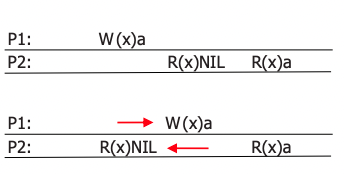
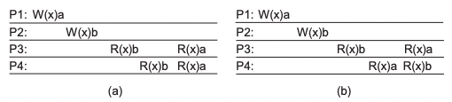
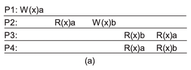
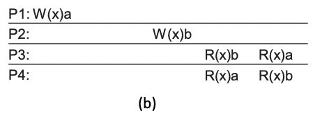

# Sistemas Distribuidos

## Capitulo 7 - Consistencia e Replicaaco

### Conceitos
* [Introducao]()
* [Consistência centrada nos dados]()
  * linearizável, 
  * sequencial, 
  * causal, 
  * read your writes, 
  * eventual.
* [Protocolos de consistência]()
  * [primary-based: remote write, local write, chain]
  * [leader-less: quórum]
* [Cassandra]
* [Gerenciamento de Replicas]()

### Introducao

Razoes para replicar
- Aumentar a _confiabilidade_ do sistema(caso alguma replica morra ou haja alguma corrupcao nos dados)
- Aumentar o desempenho e escalabilidade de tamanho e geografica do sistema, por exemplo nao sobrecarrega um unico node podendo usar a replica para distribuir a carga e estar mais proximo do usuario

> Se a replicacao ajuda tanto, qual o problema? *CONSISTENCIA*

_Esse problema de consistencia se refere a quando uma informacao precisa ser atualizada. Exemplo contador replicado, e se alguem atualizar em S1 tem um tempo para replicar, e quando alguem acessar S1 pode pegar a informacao nao atualizada = inconsistencia_

`Problema principal`: Para manter a consistencia entre as replicas, geralmente precisamos garantir que todas as `operacoes conflitantes` sejam *realizadas na mesma ordem em todas as replicas*

_Operacoes conflitantes_:
1. `read–write` conflito onde uma operação de leitura e uma de escrita ocorrem de forma concorrente
2. `write–write` conflito com duas operações concorrentes de escrita

> Garantir a ordem global de operações conflitantes pode ser _muito custoso, diminuindo a escalabilidade_

*Solucao*: diminuir os requisitos de consistência e, com sorte, conseguir evitar sincronizações globais custosas.

### Consistência centrada nos **dados**
Componentes(Modelo do sistema):
- Data store é uma colecao de dispositivos de armazenamento
- Processos que enviam operacoes de leitura e escrita
- Interacao entre um data store distribuido e os processos, no qual o data store define o resultado de operacoes concorrentes de leitura e escrita.

#### Linearizável [?]
- Informalmente: não é possível dizer que o dado está replicado.
- A operação deve ser realizada “instantaneamente” em  determinado ponto do tempo (propriedade real-time)
- Cada operação deve ser vista com um início e fim

#### Sequencial
- Faz sentido obter NILL (depois de um Write) na imagem abaixo?
  - Sim, pois pode haver um delay(`tempo de propagacao das operacoes`) de escrita e retornar nill enquanto nao escrever x=a no processo 2, inconsitencia, nao poderia ter R(x)a e depois R(x)NIL
- Note que não há início-fim nas operações como no linearizable.
- Há um tempo de propagação das operações.

> LINHA DE TEMPO do processo 1 e 2 que realiza operacoes. W =write do valor a, R=leitura de x recebendo Nil
- Processo 1 fez escrita da variavel x=a 
- Processo 2 leu x e devolve Nil    
-    

- Sequencial é facil de entender e dificil de implementar
- FoundationDB: ACID + NoSQL - criado pela Apple
- `Definicao`: _Qualquer intercalação de operações (read e write) é aceitável desde que todos os processos vejam a mesma intercalação e na ordem especificada pelo seu programa_    
Exemplo:    
-        
- Apresenta data store com consistência sequencial? Lembre que com a sequencial é possível mover o W(x)a
- Porque P3 deu _read b antes de read a_? INCONSISTENCIA SEQUENCIAL

#### Causal
> Enfraquecimento da sequencial (usando o conceito de causalidade)
- `Definicao`: Operações _de write_ que potencialmente têm uma relação de _causalidade_ devem ser vistas por todos os processos na mesma ordem
- Diferentemente da sequencial, Writes concorrentes podem ser vistos em uma ordem diferente por processos diferentes (desde que não tenham uma relação de causalidade). 
- _todos os processos NAO precisam ver a mesma intercalacao de read/write, tanto faz a ordem_

Exemplo1:     

Apresenta consistência causal?
- Observar writes, W(x)a e W(x)b tem relacao de causalidade? `Sim`, porque read le a informacao do a em P2, entao vem antes (happens before) de W(x)b. Entao o resto deveria enxergar a mesma ordem, `Nao apresenta` porque P3 e P4 deveriam obter a mesma ordem, entao a definicao fica meio verdadeira, portanto `NAO APRESENTA CONSISTENCIA CAUSAL`

Exemplo2:     
     
- _Writes concorrentes_, portanto `APRESENTA CONSISTENCIA CAUSAL`
- Pode parecer estranho a ordem de P3 e P4, e se voce nao concordar pode usar a sequencial que mantem a ordem que enxerga a intercalacao de operacoes.

#### Eventual
Dependendo da aplicação é aceitável que *as atualizações não sejam propagadas imediatamente*
- Normalmente os clientes acessam a mesma réplica, então não há problemas de inconsistência (na visão do cliente)
- Permite uma implementação de modelo de consistência com menos restrições e portanto *mais eficiente*
- Exemplos: Facebook, DNS, Paginas Web em geral
- Em algum momento vai propagar a informacao e vai chegar no cliente, doesnt matter quando.
- Relativamente fácil de implementar
- Em ausência de conflitos write-write, todas as réplicas convergirão a cópias idênticas (eventualmente)
- Assume-se que somente uma pequena quantidade de processos realiza operações de write.
- Quando acontece um conflito write-write, geralmente declara-se vencedor a última escrita, i.e., last-write-wins, sobrescrevendo as anteriores

Exemplo: Cliente C2 obtém um valor antigo

#### Protocolos de consistencia   
Descrevem a implementacao de um modelo de consistencia especifico

2 tipos, ambos centrada nos dados _consistencia SEQUENCIAL_:
1. **Primary-based**
- **Remote-write backup**
    - Data store com primary db responsavel pelo item x
    - Os demais db sao as replicas chamadas de `backup`
    - Cliente acessa a replica backup e faz o Write1, mas a replica nao é repsonsavel pelo item x 
    - O servidor entao encaminha a requisicao para o primary db
    - Ai agora sim faz o W1 e envia essa atualizacao para todas as replicas
    - e se for com sucesso os replicas avisam o primary 
    - E agora sim o servidor responde para o cliente write_ok
    - Escrita pode ser concorrente
    - primary que faz o ordenamento
    - leitura acontece imediatamente
    - _Normalmente aplicado em banco de dados distribuidos e sistemas de arquivos que requerem alto grau de tolerancia a falhas. As replicas em geral estao numa mesma LAN._
    - `Problema`: essas operacoes de escrita sao lentas, pois todas as replicas devem concordar com a escrita antes de devolver o resultado ao cliente.
    - Como resolver? tradeoffs -> Local write
- **Local Write**
  - Aqui ao inves de encaminhar para o primary, essa replica se torna o new primary
  - Imagine o cenario que o primary esta bem longe do client, e a replica esta mais perto. E isso permite modificacoes mesmo desconectado e depois de conectar manda as atualizacoes para as replicas
  - _Computacao movel em modo desconectado(envia todos os arquivos relevantes para o usuario antes do usuario se desconectar e atualiza mais tarde)_

- **Chain replication**
    - Modelo mais recente de consistencia
    - Visa garantir uma forte consistencia dos dados
    - Os servidores sao organizados em uma cadeia linear, onde cada servidor possui uma replica dos dados. O fluxo de operacoes é unidirecional, seguindo a ordem da cadeia.
    - O processo de escrita comeca no node de inicio da cadeia(head) e é propagado sequencialmente pelos nodes intermediarios ate chegar no node final(tail). Somente apos a confirmacao de gravacao no node final, finaliza a operacao de maneira completa.
    - O Chain Replication garante a `consistência forte`, pois todas as operações são executadas sequencialmente e, como o fluxo é unidirecional, `novas operações não afetam as operações que já foram confirmadas`, e todas as réplicas estejam atualizadas.

- `Possiveis problemas em todos os 3 anteriores`:
  - _Read your own write:_
    - No `local-write`, um cliente pode fazer uma escrita em um nó e, em seguida, tentar ler o mesmo dado imediatamente. Entretanto, o dado lido pode não refletir a escrita recente devido a atrasos de replicação.
    - No `remote`, um cliente pode fazer uma escrita em um nó remoto e, em seguida, tentar ler o mesmo dado imediatamente. No entanto, o dado lido pode não refletir a escrita recente devido a atrasos na replicação dos dados para outros nós.
    - `Chain`: quando um cliente escreve em um nó do final da cadeia (último nó), e em seguida, tenta ler o mesmo dado, pode enfrentar atrasos na propagação da escrita pelos nós intermediários até chegar ao nó final. Assim, a leitura imediata após a escrita pode não refletir a atualização mais recente.
  - _Monotonic read:_
    - No `local-write`, um cliente pode realizar leituras subsequentes, mas essas leituras podem não refletir as escritas mais recentes realizadas por outros clientes, devido a atrasos de replicação entre os nós.
    - No `remote`, um cliente pode realizar leituras subsequentes, mas essas leituras podem não refletir as escritas mais recentes realizadas por outros clientes, devido a atrasos na replicação entre os nós remotos.
    - `Chain`: um cliente pode realizar leituras subsequentes após a primeira leitura, mas essas leituras podem não refletir as escritas mais recentes realizadas por outros clientes. Isso acontece porque as escritas são propagadas ao longo da cadeia de réplicas, e pode haver atrasos na replicação dos dados para os nós subsequentes na cadeia.
    - Caso o head ou tail morra, nmao ha perda de escrita, pois o sucessor do antigo head vira head, e o tail se torna o antecessessor.
  
> Esses problemas são inerentes aos modelos de consistência que dependem de uma sequência de nós para replicar as operações, pois a latência entre os nós pode resultar em divergências temporárias nos dados.

`Diferenca entre o remote e local write`:
> **remote**: _todas_ as replicas devem concordar com a escrita antes de responder ao cliente
> **local**: _uma_ replica primary executa a escrita e devolve a resposta ao cliente(depois dissemina a escrita).

INTERMEDIARIO ENTRE AS DUAS : **QUORUM**

1. **Replicacao de Escrita**

**Quórum-based**: garante que toda operacao realizada quando existir uma maioria de votos: distingue o _quorum de leitura_ do _quorum de escrita_

_Requisito_: NR + NW > N ; NW >N/2
 - Garante Interseccao, que faz com que mesmo que tenha um dos valores defazados um ta atualizado no caso do read.
 - A segunda regra é necessaria pois pode ter inconsistencia de valores diferentes vindos de quorum de leitura e de escrita.
   - **ROWA**:  Read Once, Write All. Ou seja somente um para leitura e o resto para escrita. Leitura rapida, e escrita lenta. Em um sistema que tem muitas leituras e poucas escritas. Isso significa que, para realizar uma operação de escrita, é necessário obter respostas de um número maior de réplicas do que o número necessário para operações de leitura.
   - Portanto, o `ROWA backup não é um modelo de consistência sequencial`, mas sim uma estratégia específica de replicação que define como as leituras e escritas são realizadas em um sistema distribuído com várias réplicas.
   - **RAWO**: Read All, Write Once. Leitura lenta, escrita rapida. = `Cassandra`

#### Cassandra
Utiliza o conceito de anel Chord para os servidores. Utiliza o conceito de _consistent hashing_ para chaves.
- Como as escritas podem ir para qualquer servidor (já que não há um líder ou primary), é necessário considerar os seguintes problemas:
  - Writes concorrentes
  - Write com read concorrente

#### Gerenciamento de Replicas
Distingue diferentes processos: um processo é capaz de hospedar uma réplica de um objeto ou dado.
1. réplicas permanentes: processo/máquina sempre tem uma réplica
2. réplica iniciada pelo servidor: processos que podem hospedar uma réplica dinamicamente, sob demanda de um outro servidor ou data store
3. réplica iniciada pelo cliente: processos que podem hospedar uma
réplica dinamicamente, sob demanda de um cliente(_cache do cliente_)

[Slides 56 ao 57, nao entendi][?]

**Gerenciamento distribuicao de conteudo**
- Considere apenas uma combinação cliente–servidor ou servidor-servidor:
  - servidor propaga apenas a notificação/invalidação de uma atualização para clientes (normalmente usada por caches)
  - servidor transfere dados para outros servidores “réplica” (bancos de dados distribuídos): `replicação passiva`
  -  servidor propaga operações de atualização para outros servidores “réplica”: `replicação ativa`
- _Nenhuma abordagem é melhor que outra, seu uso depende da largura de banda disponível e a razão leituras/escritas nas réplicas_

Nos algoritmos epidemicos foram usadas as tecnicas de _pull_ e _push_ para disseminar infos, aqui para transferir dados ou propagar operacoes:
- _pushing_ iniciada pelo servidor; uma atualização é propagada
mesmo que o alvo não tenha pedido por ela
- _pulling_ iniciada pelo cliente; uma atualização solicitada pelo
cliente

> Podemos trocar dinamicamente entre os métodos pulling e pushing com o uso de **leases: um contrato no qual o servidor promete enviar (push) atualizações para o cliente até que o lease expire**.

`Problemas` com o lease: Fazer com que a data de expiração do lease dependa do comportamento do sistema (leases adaptativos) e assim reduzir a carga no servidor:
- `leases com idade`: um objeto que não for modificado nos últimos
tempos não será modificado em um futuro próximo, então conceda um lease que dure bastante
- `lease baseado na frequência de renovação`: quanto maior a frequência com que o cliente requisitar o objeto, maior a data de expiração para aquele cliente (o cache dele devolverá o antigo)
- `lease baseado no estado`: quando mais sobrecarregado o servidor
estiver, menor a data da expiração se torna (o servidor controlará
menos clientes, pois os leases expiram mais rapidamente).

## Capitulo 8 - Falhas e Consenso

### Conceitos
* [Contexto do Consenso]()
* [Revisao e novos conceitos]()
  * linearizável, 
  * sequencial, 
  * causal, 
  * read your writes, 
  * eventual.
* [Consenso]()
  * [Especificacao]
  * [Consenso no modelo assincrono]
  * [Consenso no modelo sincrono]
  * [Consenso no modelo parcialmente-sincrono]
* [Conclusao]